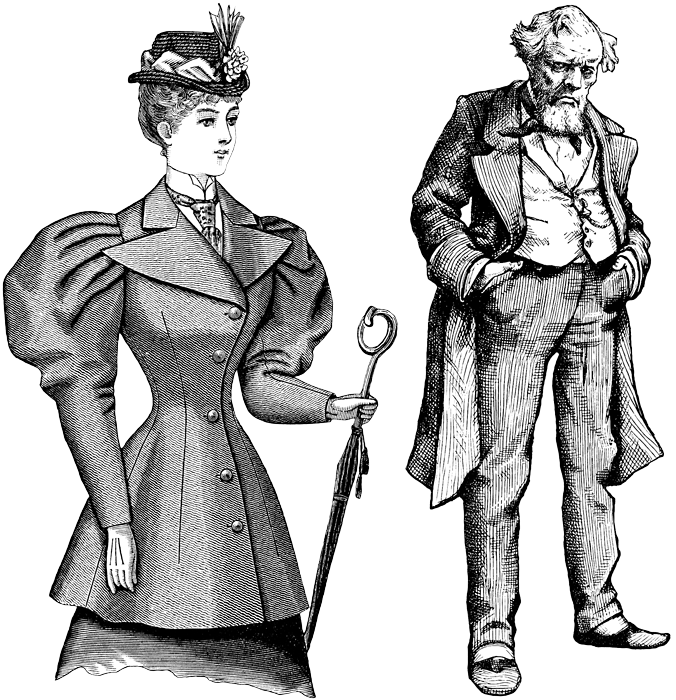

::: {.content-visible when-format="html"}
::: {#fig-railroad fig-cap="Ilustración utilizada con fines educativos. Fuente: USF ClipArt Collection (University of South Florida)." fig-number="false"}

:::
:::

::: {.content-visible when-format="pdf"}
::: {#fig-railroad-pdf fig-cap="Ilustración utilizada con fines educativos. Fuente: USF ClipArt Collection (University of South Florida)." fig-number="false"}
{width=0.6\textwidth}
:::
:::

## Presentación

El curso **Estadística y Probabilidad Descriptiva e Inferencial (EPDI)** culmina con una actividad académica formal, similar a una defensa de tesis profesional. En grupos de 2 a 4 integrantes, investigarán un fenómeno estadístico, un experimento clásico o un caso real de interés, y presentarán sus hallazgos ante un tribunal (el profesor y sus compañeros). La presentación será grabada y, con la autorización correspondiente, publicada en YouTube.

**Metodología de trabajo con IA:** Esta versión del proyecto integra un flujo de trabajo en dos etapas:

1. **DeepSeek como asistente de exploración:** Utilizarán DeepSeek para obtener respuestas estructuradas a las preguntas orientadoras de su tema. Posteriormente, deberán **verificar, parafrasear y enriquecer** esas respuestas con fuentes académicas externas (Google Scholar, OpenIntro, etc.).
2. **NotebookLM como herramienta de síntesis visual (optativa):** Quienes lo deseen, podrán copiar el contenido refinado en un cuaderno de NotebookLM para generar un **Mapa Mental interactivo**. Este mapa les permitirá visualizar conexiones conceptuales y profundizar en cada nodo con nuevas preguntas.

**Premisa fundamental:** Todo resultado generado por IA debe ser verificado, interpretado y presentado por ustedes. El valor del proyecto reside en su **pensamiento crítico**, no en delegar el trabajo a la máquina.

---

## Objetivos del proyecto

Al finalizar esta actividad, serás capaz de:

- Aplicar conceptos estadísticos (tipos de variables, asociación, causalidad, diseño experimental, muestreo, etc.) a un problema concreto.
- Utilizar **DeepSeek** y **NotebookLM** como asistentes de investigación de manera crítica y ética.
- Defender oralmente tus conclusiones ante una audiencia, con argumentos basados en datos y fuentes confiables.
- Producir un video de calidad académica que pueda ser publicado en un canal educativo.

---

## Temas para la defensa

A continuación se presentan **14 temas** cuidadosamente seleccionados para la defensa final. Cada tema aborda un experimento clásico o un problema moderno de estadística experimental, con suficiente material público disponible y amplias posibilidades para utilizar herramientas de IA (DeepSeek y NotebookLM) de manera crítica.

Cada grupo elegirá **un tema** (se recomienda variedad entre grupos). La descripción de cada tema incluye:

- El fenómeno o experimento a investigar.
- Por qué es relevante desde el punto de vista estadístico.
- Posibles enfoques de análisis y conceptos estadísticos implicados.

### Tema 1: El experimento de los stents en pacientes con ACV (2005)

**Descripción:** Este ensayo clínico real evaluó si la colocación de stents (pequeños tubos de malla para abrir arterias) prevenía nuevos accidentes cerebrovasculares en pacientes de alto riesgo. A pesar de la expectativa médica favorable, el estudio reveló que el grupo tratado con stents tuvo **más eventos adversos** que el grupo con tratamiento médico convencional. Este caso es un hito en la medicina basada en evidencia.

**Relevancia estadística:** Permite discutir conceptos fundamentales del diseño experimental: **aleatorización**, **grupo de control**, **variable respuesta** (ocurrencia de ACV o muerte) y la importancia de no confiar únicamente en la plausibilidad teórica sin datos empíricos. Se puede analizar el cálculo de riesgos relativos y absolutos, así como la decisión de detener un estudio anticipadamente por razones éticas.

### Tema 2: La paradoja de Simpson en datos de admisiones universitarias

**Descripción:** La paradoja de Simpson ocurre cuando una tendencia observada en varios grupos desaparece o se invierte al combinar los grupos. El caso más famoso es el análisis de admisiones de la Universidad de California, Berkeley en 1973, donde parecía existir un sesgo de género en las admisiones, pero al desagregar por departamento académico se descubrió que el sesgo desaparecía o se invertía.

**Relevancia estadística:** Ilustra el peligro de sacar conclusiones apresuradas a partir de datos agregados. Conceptos clave: **tablas de contingencia**, **proporciones marginales y condicionales**, y la identificación de una **tercera variable** (el departamento) que actúa como variable de confusión. Se pueden usar datos simulados o reales para construir y analizar la tabla de contingencia.

### Tema 3: Efecto placebo en cirugía de rodilla (estudio sham)

**Descripción:** El estudio de Moseley et al. (2002) comparó la efectividad de la artroscopia de rodilla para tratar osteoartritis. Un grupo recibió la cirugía real (desbridamiento o lavado) y otro grupo recibió una **cirugía simulada (sham)**: solo se les practicaron pequeñas incisiones sin intervención interna. Los resultados mostraron que la cirugía real no fue más efectiva que el placebo.

**Relevancia estadística:** Este estudio desafía la intuición sobre tratamientos invasivos y resalta la importancia del **cegamiento** y el **grupo de control con placebo**. Conceptos: comparación de medias entre grupos, análisis de varianza, e interpretación de la significancia clínica vs. estadística. También permite una discusión ética sobre el uso de placebos quirúrgicos.

### Tema 4: El experimento de la dama que cató el té (R. A. Fisher)

**Descripción:** En la década de 1920, una dama afirmó que podía distinguir si primero se echaba la leche o el té en una taza. R. A. Fisher diseñó un experimento simple pero riguroso: preparó 8 tazas (4 con leche primero, 4 con té primero) y se las presentó a la dama en orden aleatorio. La dama identificó correctamente las 8 tazas. Fisher usó el **test exacto de Fisher** para calcular la probabilidad de obtener ese resultado solo por azar.

**Relevancia estadística:** Este experimento es considerado el origen del diseño experimental moderno. Introduce la **hipótesis nula**, la **aleatorización** y el concepto de **valor‑p**. Los estudiantes pueden calcular el valor‑p exacto mediante combinatoria y discutir la importancia del control y la replicación.

### Tema 5: Sesgo de publicación en meta‑análisis de antidepresivos

**Descripción:** El estudio de Turner et al. (2008) comparó los resultados de ensayos clínicos de antidepresivos **publicados** en revistas científicas con aquellos **no publicados** (obtenidos de la FDA). Encontró que los estudios publicados mostraban resultados positivos en el 94% de los casos, mientras que el análisis completo (incluyendo los no publicados) reducía esa cifra al 51%. Este fenómeno se conoce como **sesgo de publicación**.

**Relevancia estadística:** Permite discutir cómo la evidencia disponible puede estar distorsionada. Conceptos: **meta‑análisis**, **gráficos de embudo (funnel plots)**, y el **efecto del cajón de archivos (file drawer problem)**. Los estudiantes pueden analizar la diferencia entre el tamaño del efecto reportado y el tamaño del efecto real cuando se incluyen todos los datos.

### Tema 6: Experimentos A/B en plataformas digitales

**Descripción:** Empresas como Google, Amazon o Netflix realizan continuamente **experimentos A/B** para probar cambios en sus plataformas (color de un botón, orden de los resultados, miniaturas de series). Los usuarios se asignan aleatoriamente a la versión A (control) o B (tratamiento), y se mide una métrica de éxito (tasa de clics, tiempo de visualización, conversión).

**Relevancia estadística:** Este es un ejemplo moderno de **diseño experimental a gran escala**. Conceptos: aleatorización, **pruebas de hipótesis para proporciones** (test z de dos proporciones), y cálculo del **tamaño del efecto**. Los estudiantes pueden proponer un experimento A/B hipotético (por ejemplo, en un contexto educativo) y analizar datos simulados.

### Tema 7: Estudio de los gemelos idénticos para separar genética y ambiente

**Descripción:** Los gemelos idénticos (monocigóticos) comparten el 100% de su material genético. El **Minnesota Study of Twins Reared Apart** estudió gemelos idénticos criados por separado para estimar la **heredabilidad** de rasgos como inteligencia, personalidad o habilidades específicas. Al comparar la similitud entre gemelos idénticos criados juntos vs. separados, se puede cuantificar la influencia relativa de la genética y el ambiente.

**Relevancia estadística:** Aunque es un estudio observacional, permite una aproximación a la **correlación** y la **varianza explicada**. Conceptos: **coeficiente de correlación intraclase**, **heredabilidad**, y limitaciones del diseño (sesgo del ambiente compartido). No se puede afirmar causalidad, pero sí asociación.

### Tema 8: El experimento de Milgram revisado con ética moderna

**Descripción:** Stanley Milgram (1963) diseñó un experimento para medir la obediencia a la autoridad. Los participantes ("maestros") debían administrar descargas eléctricas crecientes a un "alumno" (cómplice) cada vez que este fallaba una pregunta. Sorprendentemente, el 65% de los participantes administró la descarga máxima (450 V). El experimento generó intensos debates éticos por el uso de engaño y el estrés psicológico infligido.

**Relevancia estadística:** Aunque es un estudio de psicología social, su diseño experimental es canónico. Permite analizar: **tasas de abandono** (análisis de supervivencia), comparación de proporciones entre condiciones (ej. presencia de la víctima), y la importancia del **consentimiento informado**. Los estudiantes pueden proponer un diseño moderno que cumpla con estándares éticos actuales.

### Tema 9: Efecto de la música en el rendimiento cognitivo (experimento controlado)

**Descripción:** Este tema propone que los estudiantes **diseñen y simulen** su propio experimento. La pregunta de investigación podría ser: "¿Escuchar música instrumental mientras se resuelven problemas matemáticos mejora el rendimiento?". Los estudiantes deben definir: grupos (música vs. silencio), asignación aleatoria, variable respuesta (puntaje en una prueba) y variables de control (tipo de música, volumen, dificultad de la tarea).

**Relevancia estadística:** Es un experimento simple pero completo. Permite aplicar: **prueba t para dos muestras independientes**, cálculo de **intervalos de confianza** para la diferencia de medias, y discusión sobre posibles variables de confusión. Pueden analizar datos simulados generados por ellos mismos.

### Tema 10: Estudio de la aspirina para prevenir infartos (Physicians' Health Study)

**Descripción:** El *Physicians' Health Study* fue un ensayo clínico aleatorizado, doble ciego y controlado con placebo que evaluó si la aspirina en dosis bajas prevenía infartos de miocardio en médicos varones sanos. Participaron más de 22,000 médicos durante 5 años. El estudio se detuvo anticipadamente debido a la clara evidencia de beneficio: una reducción del 44% en el riesgo de infarto.

**Relevancia estadística:** Este estudio es un ejemplo paradigmático de ensayo clínico. Conceptos: **riesgo relativo**, **reducción absoluta del riesgo**, **número necesario a tratar (NNT)**, y la función del **Comité de Monitoreo de Datos y Seguridad (DSMB)** para detener el estudio antes de lo previsto.

### Tema 11: Correlaciones espurias y el problema de la tercera variable

**Descripción:** Dos variables pueden mostrar una correlación estadísticamente significativa sin que exista una relación causal entre ellas. Ejemplos famosos incluyen la correlación entre el número de personas que se ahogaron en piscinas y el número de películas en las que apareció Nicolas Cage, o entre el consumo de chocolate y el número de premios Nobel per cápita.

**Relevancia estadística:** Ilustra de manera divertida pero rigurosa por qué **correlación no implica causalidad**. Conceptos: **coeficiente de correlación de Pearson**, **variables de confusión** o tercera variable (ej. tamaño de la población, nivel de desarrollo), y cómo la aleatorización en experimentos permite aislar relaciones causales. Los estudiantes pueden elegir una correlación espuria famosa y proponer una tercera variable plausible.

### Tema 12: El experimento de Hawthorne (efecto de ser observado)

**Descripción:** Entre 1927 y 1932, se realizaron estudios en la fábrica Hawthorne de Western Electric para analizar cómo afectaban las condiciones de trabajo (iluminación, descansos, etc.) a la productividad. Se observó que la productividad **aumentaba** cada vez que se introducía un cambio, incluso cuando el cambio era volver a las condiciones originales. Se acuñó el término **efecto Hawthorne**: la mera conciencia de ser observado altera el comportamiento.

**Relevancia estadística:** El estudio original tuvo graves fallas metodológicas (falta de grupo de control estable, muestras pequeñas, no aleatorización). Permite discutir la importancia de un **diseño experimental riguroso**, la **validez interna** y cómo las expectativas del investigador pueden sesgar los resultados. Los estudiantes pueden proponer un diseño mejorado para aislar el efecto de la observación.

### Tema 13: Replicación del experimento de los tramposos (cheaters) con diseño factorial

**Descripción:** En experimentos sobre honestidad, se pide a los participantes lanzar una moneda en privado y reportar el resultado, sabiendo que obtienen una recompensa si sale "cara". Como el experimentador no ve el lanzamiento, la trampa se mide a nivel grupal: si el porcentaje de "caras" reportado es significativamente mayor al 50% esperado, se infiere que hubo trampa. Este tema propone replicar el diseño pero añadiendo una segunda variable mediante un **diseño factorial 2×2**.

**Relevancia estadística:** Introduce el concepto de **diseño factorial** y la posibilidad de analizar **efectos principales e interacciones**. Por ejemplo, los factores podrían ser: "instrucción explícita de no hacer trampa" (sí/no) y "presencia de un adulto" (sí/no). Se analizarían las proporciones de "caras" reportadas en cada una de las 4 condiciones mediante **pruebas de proporciones** y **tablas de contingencia**.

### Tema 14: Uso de IA para diseñar un experimento sobre el rendimiento académico

**Descripción:** Este tema invita a los estudiantes a usar **NotebookLM** como objeto de estudio. Deberán proponer un experimento que evalúe si el uso de una IA (como NotebookLM o DeepSeek) para preparar una defensa oral mejora la calidad de las respuestas. La IA les sugerirá un diseño experimental; luego, los estudiantes deberán **analizar críticamente** esa sugerencia, identificar sus fortalezas y debilidades, y proponer un diseño alternativo mejorado.

**Relevancia estadística:** Fomenta la **alfabetización crítica en IA** y el pensamiento experimental. Conceptos implicados: **aleatorización**, **grupo de control**, **cegamiento del evaluador**, y **operacionalización de variables** (¿cómo medir la "calidad" de una defensa?). Los estudiantes deben demostrar que no aceptan pasivamente lo que la IA produce, sino que lo evalúan con criterio estadístico.

---

## Avances del proyecto (entregables semanales)

Para facilitar la organización y permitir una retroalimentación continua, el proyecto se estructura en **cuatro avances semanales**. Cada avance corresponde a una sección de la defensa oral final y debe ser entregado en formato **escrito** para incorporar a un **portafolio físico**. Esta metodología les permitirá recibir correcciones y sugerencias manuscritas antes de la presentación definitiva.

| Avance | Contenido | Preguntas orientadoras | Producto entregable |
| :--- | :--- | :--- | :--- |
| **Avance 1** | Contexto y pregunta de investigación | Ver sección 5.1 | Documento impreso (1-2 páginas) |
| **Avance 2** | Metodología y datos | Ver sección 5.2 | Documento impreso (2-3 páginas) |
| **Avance 3** | Análisis estadístico | (Se entregarán oportunamente) | Documento impreso con tablas, gráficos y cálculos preliminares |
| **Avance 4** | Conclusiones e impacto | (Se entregarán oportunamente) | Documento impreso con borrador de conclusiones y limitaciones |

### Rúbrica de evaluación para Avances (100 puntos)

Cada avance será calificado con un máximo de **100 puntos**, distribuidos en tres criterios. La nota de proceso (portafolio) corresponderá al promedio de los cuatro avances y tendrá una ponderación del **30%** de la calificación final del proyecto.

| Criterio | Puntaje máximo | Descriptor de logro |
| :--- | :---: | :--- |
| **Contenido disciplinar** | 50 pts | Responde todas las preguntas orientadoras con precisión conceptual, utiliza vocabulario estadístico adecuado y demuestra comprensión del tema. |
| **Uso crítico de IA** | 30 pts | Incluye evidencia de verificación con fuentes externas (citas) e identifica y corrige al menos un error o imprecisión de la IA. El proceso de verificación se evidencia en clase durante las asesorías. |
| **Presentación y formalidad** | 20 pts | Entrega puntual, formato legible (escrito a mano o impreso), correcta ortografía y redacción, y organización clara del contenido. |

**Escala de evaluación para cada criterio:**
- **Contenido disciplinar:** 50 (excelente) - 40 (bueno) - 30 (suficiente) - 20 (insuficiente) - 10 (no logrado)
- **Uso crítico de IA:** 30 (excelente) - 24 (bueno) - 18 (suficiente) - 12 (insuficiente) - 6 (no logrado)
- **Presentación y formalidad:** 20 (excelente) - 16 (bueno) - 12 (suficiente) - 8 (insuficiente) - 4 (no logrado)

**Observaciones:**
- Los atrasos en la entrega se penalizarán con 5 puntos menos por día hábil en el criterio "Presentación y formalidad".

---

### Avance 1: Contexto y pregunta de investigación

**Objetivo:** Definir claramente el fenómeno o experimento que estudiarán, justificar su relevancia y formular la pregunta de investigación que guiará todo el trabajo.

**Preguntas orientadoras obligatorias:**

Cada grupo debe responder **únicamente las preguntas correspondientes al tema elegido**. Las respuestas deben ser elaboradas con sus propias palabras después de consultar DeepSeek y verificar con fuentes académicas.

#### TEMA 1: El experimento de los stents en pacientes con ACV (2005)

1. ¿Qué es un stent y para qué se usa habitualmente en medicina?
2. ¿Cuál era la expectativa de los médicos respecto al uso de stents en pacientes con riesgo de ACV?
3. ¿Qué fue lo que realmente ocurrió en el experimento? (Resultados principales)
4. ¿Por qué este experimento es considerado un hito en la medicina basada en evidencia?
5. Formula la pregunta de investigación que guió el estudio (en tus propias palabras).
6. ¿Qué hipótesis inicial tenían los investigadores? ¿Se confirmó o refutó?

#### TEMA 2: La paradoja de Simpson en datos de admisiones universitarias

1. Explica con tus palabras qué es la paradoja de Simpson.
2. ¿Cuál es el ejemplo clásico de la paradoja en las admisiones de la Universidad de California, Berkeley? (Caso de 1973)
3. ¿Qué variable oculta (tercera variable) explica la aparente contradicción?
4. ¿Por qué esta paradoja es importante para la interpretación de datos en general?
5. Formula una pregunta de investigación que explore cómo la paradoja de Simpson puede aparecer en otros contextos (salud, deportes, etc.).
6. ¿Qué hipótesis propondrías para explicar por qué la gente suele pasar por alto la tercera variable?

#### TEMA 3: Efecto placebo en cirugía de rodilla (estudio sham)

1. ¿Qué es un placebo y qué es el "efecto placebo"?
2. ¿En qué consiste un estudio "sham" (simulado) en cirugía?
3. Describe brevemente el estudio de Moseley et al. (2002) sobre artroscopia de rodilla.
4. ¿Qué resultados encontraron? ¿La cirugía real fue más efectiva que la simulada?
5. ¿Por qué este estudio fue controvertido desde el punto de vista ético?
6. Formula una pregunta de investigación que evalúe si el efecto placebo podría explicar otros tratamientos quirúrgicos comunes.

#### TEMA 4: El experimento de la dama que cató el té (R. A. Fisher)

1. ¿Quién fue R. A. Fisher y por qué es importante en la estadística?
2. Describe el experimento de la dama que cató el té: ¿qué afirmaba la dama y cómo lo comprobaron?
3. ¿Qué conceptos estadísticos introdujo Fisher con este experimento (hipótesis nula, aleatorización, test exacto)?
4. ¿Por qué este experimento es considerado el origen del diseño experimental moderno?
5. Formula una pregunta de investigación similar que pudieras probar con tus compañeros (ej. distinguir Coca-Cola de Pepsi).
6. ¿Qué hipótesis nula plantearías en tu versión del experimento?

#### TEMA 5: Sesgo de publicación en meta‑análisis de antidepresivos

1. ¿Qué es el sesgo de publicación (publication bias)?
2. Explica el estudio de Turner et al. (2008) que comparó ensayos publicados vs. no publicados de antidepresivos.
3. ¿Qué diferencia encontraron entre los resultados de los ensayos publicados y los no publicados?
4. ¿Por qué este sesgo es un problema grave para la medicina basada en evidencia?
5. Formula una pregunta de investigación que investigue si el sesgo de publicación podría afectar a otros campos (psicología, educación, etc.).
6. ¿Qué hipótesis propondrías sobre cómo deberían cambiar las prácticas de publicación científica?

#### TEMA 6: Experimentos A/B en plataformas digitales

1. ¿Qué es un experimento A/B? Da un ejemplo cotidiano (ej. cambio de color de un botón en una web).
2. ¿Cómo se asignan los usuarios a los grupos en un experimento A/B?
3. ¿Qué tipo de decisiones empresariales se basan en estos experimentos?
4. Menciona un caso famoso (ej. cómo Netflix prueba miniaturas de series).
5. Formula una pregunta de investigación para un experimento A/B hipotético en un contexto educativo (ej. dos métodos de explicación en un video).
6. ¿Qué hipótesis probarías y cómo medirías el éxito?

#### TEMA 7: Estudio de los gemelos idénticos para separar genética y ambiente

1. ¿Por qué los gemelos idénticos (monocigóticos) son tan valiosos para la investigación?
2. ¿Qué es el "estudio de gemelos criados por separado"? Describe el Minnesota Study of Twins Reared Apart.
3. ¿Qué resultados mostraron sobre la heredabilidad de rasgos como la inteligencia o la personalidad?
4. ¿Cuáles son las limitaciones de este tipo de estudios (por ejemplo, que no son experimentos puros)?
5. Formula una pregunta de investigación que explore si un rasgo específico (ej. habilidad musical) es más influido por la genética o por el ambiente.
6. ¿Qué hipótesis tendrías y cómo la pondrías a prueba?

#### TEMA 8: El experimento de Milgram revisado con ética moderna

1. Describe brevemente el experimento de Milgram (1963) sobre obediencia a la autoridad.
2. ¿Cuál fue el resultado sorprendente? ¿Qué proporción de participantes administró la descarga máxima?
3. ¿Qué críticas éticas se han hecho a este experimento (consentimiento, engaño, daño psicológico)?
4. ¿Cómo se diseñaría hoy un experimento similar respetando normas éticas actuales?
5. Formula una pregunta de investigación que evalúe si la obediencia ha cambiado en las últimas décadas.
6. ¿Qué variables podrían influir en la obediencia según la literatura?

#### TEMA 9: Efecto de la música en el rendimiento cognitivo (experimento controlado)

1. ¿Qué dice la cultura popular sobre escuchar música mientras se estudia? ¿Y la ciencia?
2. Describe un experimento simple que podrías diseñar para probar si la música ayuda o distrae.
3. ¿Qué variables deberías controlar (tipo de música, volumen, tarea, etc.)?
4. ¿Cómo asignarías aleatoriamente a los participantes a los grupos?
5. Formula una pregunta de investigación clara: "¿Escuchar música instrumental mientras se resuelven problemas matemáticos mejora el rendimiento?"
6. ¿Qué hipótesis plantearías? ¿Cuál sería tu grupo de control?

#### TEMA 10: Estudio de la aspirina para prevenir infartos (Physicians' Health Study)

1. ¿Qué es el Physicians' Health Study y cuál fue su objetivo principal?
2. Describe el diseño: ¿fue aleatorizado, doble ciego, con placebo?
3. ¿Cuáles fueron los resultados clave? ¿La aspirina redujo el riesgo de infarto?
4. ¿Por qué el estudio se detuvo antes de lo previsto?
5. Formula una pregunta de investigación que evalúe si otro fármaco común (ej. paracetamol) podría tener efectos protectores similares.
6. ¿Qué tamaño de muestra crees que sería necesario y por qué?

#### TEMA 11: Correlaciones espurias y el problema de la tercera variable

1. ¿Qué es una correlación espuria? Pon un ejemplo famoso (ej. Nicolas Cage y ahogamientos en piscinas).
2. ¿Por qué dos variables pueden correlacionarse sin que una cause la otra?
3. Explica el concepto de "tercera variable" o "variable de confusión" con un ejemplo.
4. ¿Cómo puede la estadística ayudar a detectar una correlación espuria?
5. Formula una pregunta de investigación que investigue si una correlación publicada en los medios podría ser espuria.
6. ¿Qué hipótesis alternativa (tercera variable) propondrías para explicar la correlación?

#### TEMA 12: El experimento de Hawthorne (efecto de ser observado)

1. ¿Qué fue el experimento de Hawthorne (1927-1932) en la fábrica Western Electric?
2. ¿Qué descubrieron inicialmente los investigadores sobre la productividad de los trabajadores?
3. ¿Qué es el "efecto Hawthorne" y por qué se llama así?
4. ¿Por qué este experimento es criticado hoy por falta de control y de aleatorización?
5. Formula una pregunta de investigación que evalúe si el efecto Hawthorne se produce en el aula (ej. cuando un profesor observa a los estudiantes).
6. ¿Qué diseño experimental propondrías para aislar el efecto de la observación?

#### TEMA 13: Replicación del experimento de los tramposos (cheaters) con diseño factorial

1. Describe el experimento original de los "tramposos" (lanzamiento de moneda y reporte de resultado).
2. ¿Cómo se midió la trampa sin saber quién mintió individualmente?
3. ¿Qué es un diseño factorial? Pon un ejemplo sencillo (ej. dos factores: instrucción y presencia de un adulto).
4. Propón una variable extra que podrías añadir al experimento original (ej. presión de grupo, recompensa mayor).
5. Formula una pregunta de investigación que evalúe cómo la instrucción explícita y la presión de grupo afectan la honestidad.
6. ¿Qué hipótesis plantearías para cada factor y para su posible interacción?

#### TEMA 14: Uso de IA para diseñar un experimento sobre el rendimiento académico

1. ¿Qué tipos de tareas académicas podrían beneficiarse o perjudicarse con el uso de IA?
2. ¿Qué dice la investigación actual sobre el uso de ChatGPT u otras IAs en educación?
3. Diseña un experimento simple: dos grupos (con IA permitida vs. sin IA) y una misma tarea.
4. ¿Cómo asignarías aleatoriamente a los estudiantes? ¿Qué variables de confusión debes controlar?
5. Formula una pregunta de investigación: "¿El uso de NotebookLM para preparar una defensa oral mejora la calidad de las respuestas?"
6. ¿Qué hipótesis tienes y cómo medirías la "calidad" (rúbrica, puntaje, etc.)?

**Formato de entrega (Avance 1):** Documento **impreso** (1-2 páginas) con las respuestas a las seis preguntas de su tema. Deben incluir al final una **bibliografía preliminar** con al menos 2 fuentes consultadas (pueden ser artículos de Google Scholar, capítulos de OpenIntro Statistics, o fuentes proporcionadas por DeepSeek y verificadas).

### Avance 2: Metodología y datos

**Objetivo:** Describir el diseño del estudio (experimental u observacional), detallar el uso de herramientas de IA (DeepSeek y NotebookLM) y documentar el proceso de verificación de la información.

**Preguntas orientadoras por tema:**

Cada grupo debe responder **únicamente las preguntas correspondientes a su tema elegido**.

#### TEMA 1: El experimento de los stents en pacientes con ACV (2005)

1. **Diseño del estudio:** ¿Se trató de un experimento aleatorizado o de un estudio observacional? Describe cómo se asignaron los pacientes a los grupos (stent vs. tratamiento médico) y qué papel jugó el **control**.
2. **Cegamiento y placebo:** ¿Hubo cegamiento (simple, doble ciego)? ¿Por qué en este caso era difícil o imposible tener un grupo placebo idéntico al stent?
3. **Fuentes de datos:** ¿De qué artículos o fuentes obtuvieron la información principal (ej. publicación en *NEJM*, revisiones posteriores)? ¿Cómo citarían esos documentos en formato APA?
4. **Uso de IA (DeepSeek y NotebookLM):** ¿Cómo utilizaron DeepSeek para obtener información sobre el diseño del estudio? ¿Cargaron en NotebookLM el artículo original o resúmenes? ¿Qué preguntas específicas le hicieron para aclarar el diseño (ej. "¿cómo se midió la variable de resultado primaria?")?

#### TEMA 2: La paradoja de Simpson en datos de admisiones universitarias

1. **Tipo de estudio:** ¿Es este un estudio experimental u observacional? ¿Por qué?
2. **Datos reales:** ¿De dónde provienen los datos del caso Berkeley 1973? ¿Existe una tabla de contingencia publicada? Si es así, reprodúzcanla y señalen los totales marginales.
3. **Variables involucradas:** Identifiquen la variable explicativa (departamento), la variable respuesta (admisión) y la tercera variable (género). ¿Cómo se operacionalizó cada una?
4. **Uso de IA (DeepSeek y NotebookLM):** ¿Cómo usaron DeepSeek para entender la paradoja? ¿Usaron NotebookLM para resumir la historia del caso o para encontrar explicaciones alternativas? ¿Qué fuentes le proporcionaron (ej. enlace a artículo de Bickel et al. 1975)?

#### TEMA 3: Efecto placebo en cirugía de rodilla (estudio sham)

1. **Diseño experimental:** Describan detalladamente el diseño: ¿cuántos grupos hubo? ¿Qué intervención recibió cada uno? ¿Fue aleatorizado?
2. **El "sham" como control:** ¿En qué consistió exactamente la cirugía simulada? ¿Por qué era necesario este control para aislar el efecto placebo?
3. **Consideraciones éticas:** ¿Cómo se manejó el consentimiento informado en este estudio? ¿Qué comité de ética lo aprobó?
4. **Uso de IA (DeepSeek y NotebookLM):** ¿Utilizaron DeepSeek para comprender el diseño sham? ¿Usaron NotebookLM para comparar este estudio con otros meta‑análisis sobre artroscopia de rodilla?

#### TEMA 4: El experimento de la dama que cató el té (R. A. Fisher)

1. **Diseño preciso:** ¿Cuántas tazas se sirvieron? ¿Cómo se aleatorizó el orden de presentación? ¿La dama conocía de antemano cuántas tazas tenían leche primero?
2. **Variables y aleatorización:** ¿Cuál era la variable explicativa (intervención) y cuál la respuesta? ¿Por qué la **aleatorización** era crucial para que el test estadístico fuera válido?
3. **Hipótesis nula:** ¿Cuál era la hipótesis nula exacta que Fisher estaba probando?
4. **Uso de IA (DeepSeek y NotebookLM):** ¿Usaron DeepSeek para reconstruir el experimento? ¿Le pidieron a NotebookLM que simulara o explicara el cálculo del valor‑p exacto para este experimento (distribución hipergeométrica)?

#### TEMA 5: Sesgo de publicación en meta‑análisis de antidepresivos

1. **Tipo de estudio y datos:** ¿Es este un estudio original o un **meta‑análisis**? ¿De dónde obtuvieron Turner et al. los datos de ensayos no publicados? (Mencionen la FDA como fuente clave).
2. **Comparación de grupos:** ¿Qué grupos de ensayos se compararon? (publicados vs. no publicados). ¿Hubo una "intervención" o simplemente se observaron diferencias?
3. **Gráfico de embudo (funnel plot):** ¿Qué es y cómo se usa para detectar sesgo de publicación?
4. **Uso de IA (DeepSeek y NotebookLM):** ¿Usaron DeepSeek para entender el concepto de sesgo de publicación? ¿Cargaron en NotebookLM la revisión sistemática de Turner o artículos relacionados?

#### TEMA 6: Experimentos A/B en plataformas digitales

1. **Diseño experimental típico:** Describan el diseño estándar de un experimento A/B: ¿cómo se asignan usuarios a variante A o B? ¿Qué es la **aleatorización** en este contexto?
2. **Métrica de éxito:** ¿Qué variable se mide comúnmente (tasa de clics, conversión, tiempo de visualización)?
3. **Caso de estudio específico:** Si eligen un caso de Netflix o similar, ¿de dónde obtuvieron la información? ¿Es un artículo de blog de la empresa o una publicación académica?
4. **Uso de IA (DeepSeek y NotebookLM):** ¿Usaron DeepSeek para comprender el diseño A/B? ¿Usaron NotebookLM para diseñar su **propio** experimento A/B hipotético? ¿Cómo les ayudó a definir una hipótesis clara y una métrica medible?

#### TEMA 7: Estudio de los gemelos idénticos para separar genética y ambiente

1. **Tipo de estudio:** ¿Es un experimento o un estudio observacional? ¿Por qué? ¿Qué característica natural de los gemelos idénticos lo hace tan especial?
2. **Diseño del Minnesota Study of Twins Reared Apart:** ¿Cómo se reclutó a los participantes? ¿Qué variables se midieron (inteligencia, personalidad, etc.)? ¿Hubo un grupo de control?
3. **Limitaciones metodológicas:** ¿Por qué no se puede afirmar **causalidad** definitiva con este diseño? Mencionen el sesgo del ambiente compartido en la infancia temprana.
4. **Uso de IA (DeepSeek y NotebookLM):** ¿Usaron DeepSeek para explorar el diseño del estudio? ¿Cargaron resúmenes del estudio MISTRA o artículos de revisión en NotebookLM? ¿Cómo les ayudó NotebookLM a distinguir entre conceptos como **heredabilidad** y **causalidad genética**?

#### TEMA 8: El experimento de Milgram revisado con ética moderna

1. **Diseño experimental original:** Describan los roles (experimentador, maestro, alumno). ¿Qué tipo de **aleatorización** se utilizó, si alguna? ¿Cuál era la variable independiente manipulada (las órdenes del experimentador)?
2. **Engaño y cegamiento:** ¿En qué consistió el engaño? ¿Cómo afectó esto al diseño ético?
3. **Propuesta de diseño moderno:** Si ustedes diseñaran una réplica ética, ¿cómo modificarían el **consentimiento informado** y la **sesión de debriefing**? ¿Qué variables de confusión intentarían controlar?
4. **Uso de IA (DeepSeek y NotebookLM):** ¿Usaron DeepSeek para obtener información sobre el experimento original? ¿Usaron NotebookLM para comparar las normas éticas de la APA en 1963 versus las actuales?

#### TEMA 9: Efecto de la música en el rendimiento cognitivo (experimento controlado)

1. **Diseño experimental propio:** Describan el diseño que proponen (grupo experimental vs. grupo control). ¿Cómo **aleatorizarían** la asignación de participantes?
2. **Variables de control:** ¿Qué variables mantendrían constantes (tipo de música, volumen, complejidad de la tarea matemática, hora del día)?
3. **Operacionalización de la variable respuesta:** ¿Cómo medirían el "rendimiento cognitivo"? (número de aciertos, tiempo de respuesta, etc.).
4. **Uso de IA (DeepSeek y NotebookLM):** ¿Usaron DeepSeek para generar ideas de protocolo experimental? ¿Utilizaron NotebookLM para revisar qué dice la literatura existente? ¿Qué artículos clave encontraron gracias a las fuentes sugeridas por la IA?

#### TEMA 10: Estudio de la aspirina para prevenir infartos (Physicians' Health Study)

1. **Diseño del estudio:** ¿Fue **aleatorizado**, **doble ciego** y **controlado con placebo**? Expliquen cada uno de estos términos aplicados al estudio.
2. **Tamaño de muestra y seguimiento:** ¿Cuántos médicos participaron? ¿Durante cuánto tiempo fueron seguidos? ¿Por qué un tamaño de muestra tan grande era necesario para detectar diferencias en infartos?
3. **Detención temprana:** ¿Qué papel jugó el **Comité de Monitoreo de Datos y Seguridad (DSMB)** en la decisión de detener el estudio antes de lo previsto?
4. **Uso de IA (DeepSeek y NotebookLM):** ¿Usaron DeepSeek para comprender los detalles del diseño? ¿Cargaron en NotebookLM la publicación original del *New England Journal of Medicine* (1989)? ¿Cómo les ayudó a extraer los datos específicos sobre la reducción del riesgo relativo y absoluto?

#### TEMA 11: Correlaciones espurias y el problema de la tercera variable

1. **Diseño (ausencia de él):** ¿Por qué la mayoría de las correlaciones espurias provienen de **estudios observacionales** y no de experimentos?
2. **Recolección de datos:** ¿De qué bases de datos o sitios web se suelen extraer estos datos curiosos (ej. Spurious Correlations de Tyler Vigen)? ¿Qué tipo de variables se cruzan?
3. **Identificación de la tercera variable:** ¿Qué método estadístico o lógico se usa para **sospechar** que una correlación es espuria? (Pensar en el sentido común y en variables de confusión como el crecimiento poblacional).
4. **Uso de IA (DeepSeek y NotebookLM):** ¿Usaron DeepSeek para entender el concepto? ¿Le pidieron a NotebookLM que inventara o analizara una correlación espuria relacionada con la aviación? ¿Qué fuentes les proporcionó para entender el concepto de "regresión espuria"?

#### TEMA 12: El experimento de Hawthorne (efecto de ser observado)

1. **Diseño original (con fallos):** Describan las fases del estudio (cambios de iluminación, descansos, etc.). ¿Hubo **aleatorización** en la asignación de trabajadores a las condiciones? ¿Hubo un **grupo de control** estable?
2. **Tipo de estudio:** Aunque se le llame "experimento", ¿es realmente un experimento en el sentido moderno? ¿Por qué se considera hoy un estudio cuasi‑experimental con graves problemas de validez interna?
3. **El "efecto Hawthorne":** ¿Cómo se define actualmente en metodología de la investigación?
4. **Uso de IA (DeepSeek y NotebookLM):** ¿Usaron DeepSeek para investigar la historia del experimento? ¿Usaron NotebookLM para contrastar la narrativa popular del "Efecto Hawthorne" con las críticas metodológicas modernas (ej. los análisis de Steven Levitt)?

#### TEMA 13: Replicación del experimento de los tramposos (cheaters) con diseño factorial

1. **Diseño factorial propuesto:** Definan claramente los **factores** e **interacción** que investigarían (ej. Factor A: Instrucción "no hagan trampa" vs. "sin instrucción"; Factor B: Presencia de adulto vs. Solos). ¿Cuántos grupos experimentales tendrían?
2. **Aleatorización:** ¿Cómo asignarían aleatoriamente a los participantes a las 4 condiciones experimentales? ¿Por qué es importante hacerlo de forma individual y no por grupos naturales (ej. cursos)?
3. **Medición de la trampa:** ¿Cómo medirían la variable respuesta **sin poder identificar a tramposos individuales**? (Usar el método del lanzamiento de moneda y comparar proporciones grupales).
4. **Uso de IA (DeepSeek y NotebookLM):** ¿Usaron DeepSeek para comprender el diseño factorial? ¿Usaron NotebookLM para calcular el **tamaño de muestra necesario** o para entender cómo se analiza estadísticamente un diseño factorial 2x2?

#### TEMA 14: Uso de IA para diseñar un experimento sobre el rendimiento académico

1. **Diseño experimental en aula:** Describan el diseño propuesto (grupo con NotebookLM vs. grupo sin NotebookLM). ¿Cómo **aleatorizarán** la asignación dentro del curso para evitar sesgos de habilidad previa?
2. **Variables de control y confusión:** ¿Qué factores intentarán controlar? (Ej. acceso previo a la tecnología, nivel de conocimientos previos sobre el tema). ¿Cómo medirán el conocimiento previo?
3. **Instrumento de medición:** ¿Qué **rúbrica** o puntaje usarán para medir la "calidad" de la defensa oral? ¿Será una evaluación ciega (el evaluador no sabe a qué grupo pertenece el alumno)?
4. **Uso de IA (DeepSeek y NotebookLM):** **Este tema es especial.** Además de usar DeepSeek para información general, deben documentar cómo usaron NotebookLM como **objeto de estudio**. ¿Qué prompts usaron para diseñar la tarea que los participantes con IA debían resolver? ¿Cómo les ayudó la herramienta a identificar los sesgos potenciales de su propio experimento?

**Formato de entrega (Avance 2):** Documento **impreso** (2-3 páginas) con las respuestas a las preguntas de su tema. Deben incluir la **bibliografía actualizada** (mínimo 3 fuentes académicas verificadas).

### Avance 3: Análisis estadístico (próximamente)

**Objetivo:** Presentar tablas, gráficos y medidas resumen; aplicar pruebas de hipótesis o intervalos de confianza según corresponda.

*Las preguntas orientadoras detalladas para este avance se entregarán después del Avance 2, una vez que cada grupo tenga clara la metodología de su tema.*

### Avance 4: Conclusiones e impacto (próximamente)

**Objetivo:** Responder a la pregunta de investigación, discutir limitaciones y reflexionar sobre el impacto del fenómeno estudiado.

*Las preguntas orientadoras detalladas para este avance se entregarán después del Avance 3.*

---

## Estructura de la defensa oral (recordatorio)

Aunque el trabajo se organiza en avances semanales, la **defensa oral final** deberá integrar todos los contenidos en una presentación de 12 minutos (+ 5 de preguntas), siguiendo esta secuencia:

1. **Contexto y pregunta de investigación** (≈ 2 min) — *Basado en Avance 1*
2. **Metodología y datos** (≈ 3 min) — *Basado en Avance 2*
3. **Análisis estadístico** (≈ 4 min) — *Basado en Avance 3*
4. **Conclusiones e impacto** (≈ 3 min) — *Basado en Avance 4*

---

## Uso de herramientas de IA (obligatorio y evaluado)

El proyecto requiere el uso **crítico y transparente** de IA. A continuación se detalla el flujo de trabajo esperado.

### Fase 1: Exploración con DeepSeek (obligatorio)

1. **Interacción inicial:** Utilicen DeepSeek para obtener respuestas preliminares a las preguntas orientadoras de su tema.
2. **Registro de prompts:** Conserven los prompts utilizados y las respuestas obtenidas (se discutirán en clase durante las asesorías).
3. **Verificación y paráfrasis:** Comparen las respuestas de DeepSeek con fuentes académicas externas (artículos de Google Scholar, capítulos de OpenIntro Statistics, etc.). Reescriban el contenido con sus propias palabras, corrigiendo cualquier error detectado.
4. **Profundización:** Añadan información adicional que DeepSeek no haya cubierto, citando adecuadamente las fuentes.

### Fase 2: Síntesis visual con NotebookLM (optativo)

1. **Preparación del texto:** Organicen las respuestas verificadas y parafraseadas en un único documento estructurado (ej. con encabezados claros: Contexto, Metodología, Resultados, etc.).
2. **Generación del Mapa Mental:** Creen un nuevo cuaderno en NotebookLM, peguen el documento como fuente y soliciten la generación de un **Mapa Mental**.
3. **Exploración interactiva:** Hagan clic en los nodos del mapa para expandir conceptos y, si lo desean, realicen preguntas adicionales a NotebookLM basadas en esos nodos.
4. **Inclusión en la defensa:** Si usan esta herramienta, muestren una captura del mapa mental y expliquen qué conexiones descubrieron gracias a él.

---

## Grabación y publicación (voluntario pero recomendado)

- La defensa será **grabada en video** durante la jornada de presentaciones.
- Al inicio del video, cada integrante dirá su nombre y curso.
- **Con la autorización de apoderados** (se entregará carta modelo), los mejores videos se publicarán en el canal de YouTube del colegio.
- La publicación es voluntaria; ningún estudiante será obligado a aparecer en internet.

---

## Criterios de evaluación (rúbrica final)

| Criterio | Ponderación | Indicadores |
| :--- | :--- | :--- |
| **Dominio conceptual y estadístico** | 35% | Correcta identificación de variables, tipos de estudio, análisis e interpretación de datos. |
| **Uso crítico de IA (DeepSeek y NotebookLM)** | 20% | Calidad de prompts, verificación de respuestas con fuentes externas, detección y corrección de errores, transparencia en el proceso. |
| **Calidad de la presentación oral** | 20% | Claridad, estructura, vocabulario técnico, manejo del tiempo, respuesta a preguntas. |
| **Material de apoyo (diapositivas, gráficos)** | 15% | Diseño profesional, gráficos legibles, citas de fuentes. |
| **Formalidad y cumplimiento** | 10% | **Uniforme oficial del colegio**, puntualidad, entrega de portafolio, autorización de publicación (si aplica). |

**Nota:** La calificación final se compone de un **30%** correspondiente al promedio de los avances del portafolio (evaluados con la rúbrica de 100 puntos) y un **70%** correspondiente a la defensa oral (evaluada con esta rúbrica).

---

## Preguntas frecuentes

**¿Puedo usar otra IA además de DeepSeek y NotebookLM?**
Sí, pero debes indicarlo y justificar por qué la elegiste. DeepSeek se recomienda por su capacidad de razonamiento y gratuidad; NotebookLM por su integración con Google Workspace y la funcionalidad de Mapa Mental.

**¿Qué pasa si la IA da una respuesta incorrecta?**
Se espera que la detectes y corrijas. Eso suma puntos en el criterio de "verificación".

**¿Puedo pedir a la IA que redacte la presentación completa?**
No. La IA es una asistente, no una sustituta. Debes redactar con tus palabras; el uso excesivo de texto generado será penalizado.

**¿El Mapa Mental de NotebookLM es obligatorio?**
No. Es una herramienta optativa que puede enriquecer tu comprensión visual, pero no afecta negativamente la nota si decides no usarla.

**¿Qué debo vestir el día de la defensa?**
Debes presentarte con el **uniforme oficial del colegio**, en impecable estado de presentación personal. No se permiten variaciones informales (buzo, poleras no institucionales, etc.).

---

## Anexos

- Carta de autorización para publicación en YouTube (se entregará en papel).
- Plantilla para el portafolio de avances (descargable desde Classroom).

---

**¡Manos a la obra!** Este proyecto es la oportunidad de demostrar todo lo que han aprendido y, de paso, convertirse en usuarios críticos y responsables de la inteligencia artificial. Cualquier duda, consulten con el profesor.

**Prof. Hans Sigrist**
