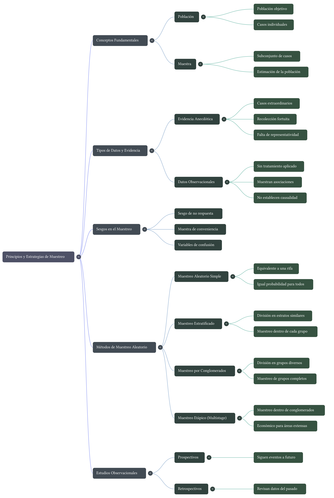

::: {.callout-note appearance="simple"}
## Recursos de la lección

- [Principios del Muestreo (video)]( /epdi/media/Principios_del_Muestreo.mp4)
- [El Poder del Muestreo (video)]( /epdi/media/El_Poder_del_Muestreo.mp4) ("selecición=selección")
- [La arquitectura de los datos (PDF)]( /epdi/media/la-arquitectura-de-los-datos.pdf)
:::

## Objetivos de la lección

Al finalizar esta lección, los estudiantes serán capaces de:

- Definir y distinguir entre **población**, **muestra**, **individuo** y **variable**.
- Identificar y criticar la **evidencia anecdótica**.
- Explicar por qué el **muestreo aleatorio** es fundamental para evitar sesgos.
- Describir y comparar cuatro métodos de muestreo: **simple**, **estratificado**, **por conglomerados** y **multietápico**.
- Diferenciar entre **estudio observacional** y **experimento**, y comprender qué tipo de conclusiones permite cada uno.
- Reconocer el concepto de **variable de confusión** y su impacto en la interpretación de resultados.

---

## Población y muestra

### Conceptos fundamentales

En estadística, rara vez podemos estudiar a **todos** los individuos que nos interesan. Por eso, trabajamos con muestras.

- **Población:** Es el conjunto completo de individuos (personas, objetos, eventos) que queremos estudiar.
- **Muestra:** Es un subconjunto de la población, seleccionado para participar en el estudio.
- **Individuo (o caso):** Cada elemento de la población o muestra.

**Ejemplo 1:** Queremos saber el tiempo promedio que tardan los estudiantes de enseñanza media en Chile en elegir su electivo.

- **Población:** Todos los estudiantes de enseñanza media de Chile.
- **Muestra:** Un grupo de 500 estudiantes seleccionados de diferentes colegios.
- **Individuo:** Un estudiante específico.

### Evidencia anecdótica

A menudo sacamos conclusiones basadas en casos particulares que conocemos. Esto se llama **evidencia anecdótica**.

> **Definición:** La evidencia anecdótica son datos recopilados de forma informal o casual, generalmente basados en experiencias personales o casos aislados, que pueden no ser representativos de la población.

**Problema:** La evidencia anecdótica suele basarse en casos extraordinarios que recordamos precisamente por ser inusuales. No podemos generalizar a partir de ellos.

**Ejemplo 2:** Conoces a dos personas que fumaron toda su vida y vivieron hasta los 95 años. Esto no es evidencia de que fumar sea saludable; es una anécdota.

> **Para reflexionar:** ¿Por qué los medios de comunicación suelen recurrir a la evidencia anecdótica? ¿Qué efecto tiene en la audiencia?

---

## Muestreo aleatorio y sesgos

###  La necesidad de la aleatoriedad

Para que una muestra sea representativa de la población, debe seleccionarse de manera aleatoria. El **muestreo aleatorio** asegura que todos los individuos tienen una oportunidad conocida (a menudo igual) de ser elegidos, lo que reduce el riesgo de sesgo.

> **Definición de sesgo:** Error sistemático que hace que los resultados de un estudio se desvíen de la verdad en una dirección particular.

### Tipos de sesgos comunes

1.  **Sesgo de selección:** Ocurre cuando la forma de seleccionar la muestra favorece a ciertos individuos sobre otros.
    - *Ejemplo:* Encuestar solo a personas que salen de un gimnasio para estudiar hábitos de ejercicio. Se excluye a quienes no van al gimnasio.

2.  **Sesgo de no respuesta:** Sucede cuando las personas seleccionadas para la muestra no responden, y los que responden son diferentes de los que no lo hacen.
    - *Ejemplo:* Una encuesta política por teléfono fijo. Las personas más jóvenes (que solo usan celular) quedan excluidas, y los que responden pueden tener opiniones distintas.

3.  **Sesgo de conveniencia:** Se da cuando la muestra se compone de individuos fácilmente accesibles, que pueden no representar a la población.
    - *Ejemplo:* Parar a personas en una calle céntrica de San Felipe para preguntar sobre la economía nacional. La muestra no incluirá a quienes trabajan en el campo o en otras ciudades.

---

## Métodos de muestreo

Existen varias formas de obtener una muestra aleatoria. La elección depende de la naturaleza de la población y los recursos disponibles.

### Muestreo aleatorio simple (MAS)

Es el más básico. Cada individuo de la población tiene la misma probabilidad de ser elegido, y la selección de uno no influye en la de los demás (como un sorteo).

- **Ventaja:** Simple y fácil de entender.
- **Desventaja:** Puede ser logísticamente difícil o costoso si la población está muy dispersa.

### Muestreo estratificado

La población se divide en grupos homogéneos llamados **estratos** (ej. por curso, sexo, nivel socioeconómico). Luego, se toma una muestra aleatoria simple **dentro de cada estrato**.

- **Ventaja:** Asegura que todos los grupos importantes estén representados. Útil cuando los estratos son muy diferentes entre sí.
- **Ejemplo:** Para estudiar el rendimiento en una asignatura, estratificamos por colegio (municipal, particular subvencionado, particular) y muestreamos dentro de cada tipo.

### Muestreo por conglomerados (clusters)

La población se divide en grupos naturales llamados **conglomerados** (ej. barrios, cursos escolares, manzanas). Se seleccionan aleatoriamente algunos conglomerados y se **estudia a todos los individuos** dentro de ellos.

- **Ventaja:** Reduce costos logísticos. Ideal cuando la población está muy dispersa.
- **Desventaja:** Puede ser menos preciso que el estratificado si los conglomerados son muy heterogéneos.
- **Ejemplo:** Para estimar la prevalencia de una enfermedad en una ciudad, seleccionamos aleatoriamente 10 barrios y examinamos a todos los residentes de esos barrios.

### Muestreo multietápico

Es una extensión del muestreo por conglomerados. Se seleccionan conglomerados en varias etapas, y dentro de los conglomerados finales se toma una muestra aleatoria (no todos los individuos).

- **Ventaja:** Muy eficiente para poblaciones grandes y dispersas.
- **Ejemplo:** Para una encuesta nacional, primero seleccionamos regiones, luego comunas dentro de esas regiones, luego manzanas, y finalmente hogares dentro de esas manzanas.

> **Comparación rápida:**

> - **Estratificado:** Se muestrea **dentro** de todos los grupos.
> - **Conglomerados:** Se muestrean **algunos** grupos y se estudian **todos** sus individuos.
> - **Multietápico:** Se muestrean grupos en varias fases y luego se muestrea **dentro** de los grupos finales.

---

## Tipos de estudios: Observacionales vs. Experimentales

### Estudio observacional

El investigador **observa y mide** variables sin intervenir ni manipular el entorno. Simplemente registra lo que ocurre.

- **Puede:** Identificar **asociaciones** entre variables.
- **No puede:** Establecer **causalidad** de forma concluyente (debido a posibles variables de confusión).

### Experimento

El investigador **manipula activamente** una variable (el tratamiento) y asigna aleatoriamente los sujetos a grupos (tratamiento vs. control).

- **Puede:** Establecer relaciones **causales** con mayor confianza, gracias a la aleatorización que controla variables de confusión.

### Variable de confusión (tercera variable)

Es una variable que está asociada tanto con la variable explicativa como con la variable respuesta, y que puede distorsionar la relación observada entre ellas.

**Ejemplo clásico:** La correlación entre ventas de helados y ahogamientos en piscinas. La variable de confusión es la **temperatura**: hace que la gente compre más helados y también que vaya más a la piscina, aumentando el riesgo de ahogamiento.

---

## Mapa conceptual: Principios y estrategias de muestreo

Para tener una visión de conjunto de los conceptos que exploraremos, aquí tienes un mapa mental que los organiza visualmente:

{#fig-muestreo-mapa fig-alt="Diagrama de mapa mental que muestra las relaciones entre población, muestra, evidencia anecdótica, datos observacionales y métodos de muestreo aleatorio."}

En este mapa puedes ver cómo se relacionan las ideas de **población** y **muestra**, los peligros de la **evidencia anecdótica**, la distinción entre **estudios observacionales** y **experimentos**, y los distintos **métodos de muestreo aleatorio** que estudiaremos en detalle.
## Análisis de ejercicios (Cuestionario)

## Cuestionario grupal

A continuación, se presentan una serie de ejercicios basados en estudios reales. Para cada uno, deberás identificar los conceptos clave y responder las preguntas con el mayor detalle y rigor posible.

1. **Contaminación del aire y partos prematuros**

Investigadores recolectaron datos para examinar la relación entre contaminantes atmosféricos y partos prematuros en el sur de California. Durante el estudio, los niveles de contaminación se midieron mediante estaciones de monitoreo de calidad del aire. Se recopilaron datos de la duración de la gestación de 143.196 nacimientos entre los años 1989 y 1993, y se calculó la exposición a la contaminación durante la gestación para cada nacimiento. El análisis sugirió que el aumento de PM₁₀ y CO podría estar asociado con la ocurrencia de partos prematuros.

(a) Identifica la población de interés y la muestra en este estudio.
(b) Comenta si los resultados del estudio pueden generalizarse a la población y si pueden usarse para establecer relaciones causales.

---

2. **Método Buteyko**

El método Buteyko es una técnica de respiración superficial. En un estudio para determinar su efectividad, se reclutó a 600 pacientes asmáticos de entre 18 y 69 años que dependían de medicación. Estos pacientes se dividieron **aleatoriamente** en dos grupos: uno practicó el método Buteyko y el otro no. En promedio, el grupo Buteyko experimentó una reducción significativa de los síntomas y una mejora en la calidad de vida.

(a) Identifica la población de interés y la muestra en este estudio.
(b) ¿Es un estudio observacional o un experimento? Justifica.
(c) ¿Podemos concluir que el método Buteyko causa la mejora en los síntomas? Explica.

---

3. **Tramposos**

Investigadores estudiaron la relación entre honestidad, edad y autocontrol con 160 niños de 5 a 15 años. Los participantes informaron su edad, sexo y si eran hijos únicos. Luego, se les pidió que lanzaran una moneda en privado y registraran el resultado (blanco o negro), diciéndoles que solo serían recompensados si reportaban "blanco". La mitad de los niños recibió la instrucción explícita de no hacer trampa; la otra mitad no. Se observaron diferencias en las tasas de trampa entre los grupos.

(a) Identifica la población de interés y la muestra.
(b) ¿Podemos generalizar estos resultados a todos los niños? ¿Por qué?
(c) ¿Podemos establecer una relación causal entre la instrucción explícita y la reducción de la trampa? Justifica.

---

4. **Estatus social y comportamiento no ético**

En un estudio, 129 estudiantes de la Universidad de California en Berkeley se identificaron a sí mismos como de clase baja o alta. Luego, se les presentó un frasco de caramelos, informándoles que eran para niños de un laboratorio cercano, pero que podían tomar algunos si querían. Los estudiantes de clase alta tomaron más caramelos que los de clase baja.

(a) Identifica la población de interés y la muestra.
(b) ¿Podemos generalizar estos resultados a todos los adultos? Explica.
(c) ¿Podemos concluir que el estatus social alto *causa* un comportamiento menos ético? ¿Qué variable de confusión podría existir?

---

5. **Relajación después del trabajo**

La Encuesta Social General preguntó a una **muestra aleatoria** de 1.155 estadounidenses: "Después de un día de trabajo promedio, ¿cuántas horas tienes para relajarte o realizar actividades que disfrutes?". El tiempo promedio de relajación fue de 1,65 horas. Determina si cada elemento es una **observación**, una **variable**, un **estadístico muestral** o un **parámetro poblacional**:

(a) Un estadounidense en la muestra.
(b) Número de horas dedicadas a relajarse después de un día laboral promedio.
(c) 1,65.
(d) Número promedio de horas que todos los estadounidenses pasan relajándose después de un día laboral promedio.

---

6. **Métodos de muestreo**

Una universidad quiere determinar qué fracción de sus estudiantes de pregrado apoya una nueva tarifa anual de 25 mil pesos para mejorar el centro estudiantil. Para cada método propuesto, indica si es razonable o no, y por qué.

(a) Encuestar una muestra aleatoria simple de 500 estudiantes.
(b) Estratificar a los estudiantes por su campo de estudio, y luego muestrear el 10% de cada estrato.
(c) Agrupar a los estudiantes por su edad (ej. todos los de 18 años en un grupo, los de 19 en otro, etc.), luego muestrear aleatoriamente tres grupos y encuestar a todos los estudiantes de esos grupos.

---

## Preguntas para reflexionar y debatir en clase

1. **Evidencia anecdótica vs. datos sistemáticos:** ¿Por qué crees que la evidencia anecdótica es tan persuasiva, a pesar de ser poco fiable? ¿Puedes recordar alguna situación en la que hayas sacado una conclusión basada en una anécdota y luego te hayas dado cuenta de que no era generalizable?

2. **Sesgo de no respuesta:** En una encuesta política online, ¿quiénes crees que tienen más probabilidades de responder? ¿Cómo podría esto sesgar los resultados?

3. **Muestreo en San Felipe:** Diseña un plan de muestreo para estimar la proporción de habitantes de San Felipe que están a favor de construir una nueva ciclovía. ¿Qué método usarías y por qué? ¿Qué dificultades prácticas encontrarías?

4. **Causalidad en medios:** Busca un titular de noticias que afirme una relación causal (ej. "Comer chocolate adelgaza"). ¿Qué tipo de estudio crees que está detrás? ¿Qué variables de confusión podrían explicar realmente el hallazgo?

5. **Experimentos en la vida cotidiana:** Piensa en una decisión que hayas tomado recientemente y que podría haberse beneficiado de un "experimento" (ej. probar dos métodos de estudio diferentes). ¿Cómo habrías diseñado un experimento simple para tomar una mejor decisión?

---

## Resumen de conceptos clave

| Concepto | Definición breve |
| :--- | :--- |
| **Población** | Conjunto completo de individuos de interés. |
| **Muestra** | Subconjunto de la población del que se recogen datos. |
| **Individuo** | Un elemento de la población o muestra. |
| **Evidencia anecdótica** | Datos basados en casos aislados y no representativos. |
| **Sesgo** | Error sistemático que desvía los resultados. |
| **Muestreo aleatorio simple** | Cada individuo tiene igual probabilidad de ser elegido. |
| **Muestreo estratificado** | Se divide en grupos homogéneos y se muestrea dentro de cada uno. |
| **Muestreo por conglomerados** | Se eligen grupos al azar y se estudian todos sus individuos. |
| **Muestreo multietápico** | Combinación de muestreo por conglomerados y aleatorio simple. |
| **Estudio observacional** | El investigador observa sin intervenir. |
| **Experimento** | El investigador manipula una variable y asigna aleatoriamente. |
| **Variable de confusión** | Variable asociada a las que se estudian y que puede falsear la relación. |

---

Este material está diseñado para ser trabajado en clase de forma colaborativa. Se recomienda dedicar tiempo a la discusión de los ejercicios y las preguntas de reflexión.
