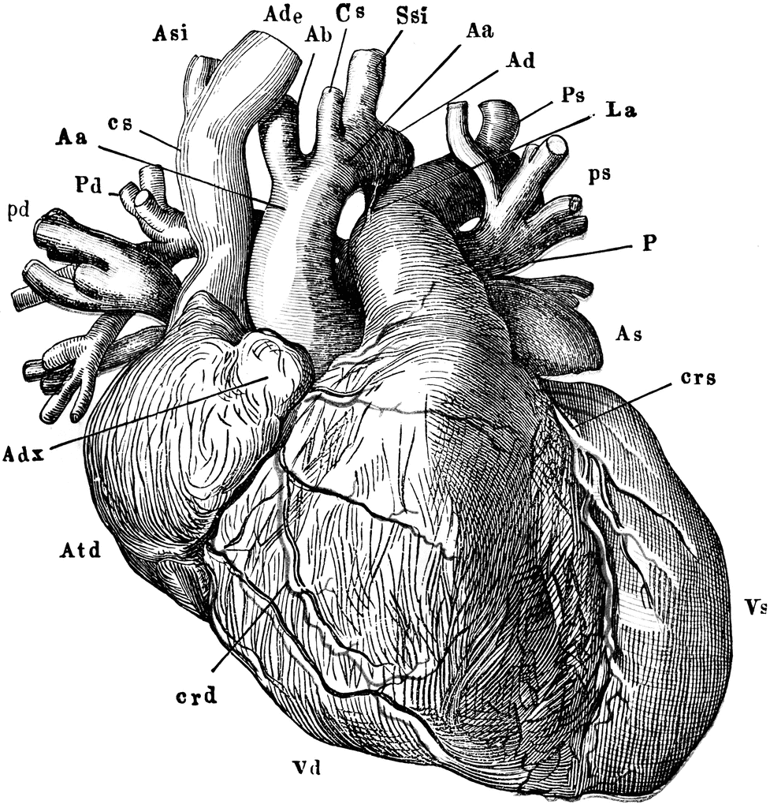

::: {.content-visible when-format="html"}
::: {#fig-railroad fig-cap="Ilustración utilizada con fines educativos. Fuente: USF ClipArt Collection (University of South Florida)." fig-number="false"}

:::
:::

::: {.content-visible when-format="pdf"}
::: {#fig-railroad-pdf fig-cap="Ilustración utilizada con fines educativos. Fuente: USF ClipArt Collection (University of South Florida)." fig-number="false"}
{width=0.6\textwidth}
:::
:::

## Objetivos de la lección

Al finalizar esta lección, los estudiantes serán capaces de:

- Diferenciar claramente entre un **estudio observacional** y un **experimento**.
- Explicar por qué los experimentos aleatorizados son el "estándar de oro" para establecer causalidad.
- Identificar y aplicar los **cuatro principios del diseño experimental**: control, aleatorización, replicación y bloqueo.
- Comprender el concepto de **placebo** y la importancia del **cegamiento** (simple y doble) para reducir sesgos en estudios con humanos.
- Reflexionar sobre las implicaciones éticas de los experimentos, especialmente aquellos que involucran tratamientos potencialmente riesgosos o placebos.

---

## Experimentos: más allá de la asociación

Como vimos en la lección anterior, los **estudios observacionales** pueden identificar asociaciones, pero no pueden establecer causalidad de manera concluyente debido a la posible existencia de **variables de confusión**. Para demostrar que una variable **causa** un efecto en otra, necesitamos realizar un **experimento**.

> **Definición:** Un **experimento** es un estudio en el que los investigadores **asignan activamente** un tratamiento a los sujetos (casos). Cuando esta asignación se hace al azar (por ejemplo, lanzando una moneda), se denomina **experimento aleatorizado**.

El experimento aleatorizado es la herramienta más poderosa para inferir causalidad, porque la aleatorización ayuda a equilibrar, tanto las variables conocidas como las desconocidas, entre los grupos de tratamiento y control.

### Recordatorio: El caso de los stents

En la **Lección 1** estudiamos un experimento clínico para evaluar si los stents reducían el riesgo de ACV en pacientes de riesgo. Los investigadores asignaron aleatoriamente a los pacientes a dos grupos: **tratamiento** (con stent) y **control** (sin stent). Gracias a esta aleatorización, pudieron concluir que los stents no solo no ayudaban, sino que aumentaban el riesgo de ACV. Este es un ejemplo clásico de experimento aleatorizado.

---

## Principios del diseño experimental

Los experimentos aleatorizados bien diseñados se basan en cuatro principios fundamentales.

### Control

Los investigadores deben **controlar** cualquier otra diferencia entre los grupos que no sea el tratamiento de interés. Esto significa que, aparte del tratamiento, ambos grupos deben ser tratados de la manera más idéntica posible.

- **Ejemplo:** Si se prueba un fármaco en pastillas, se debe indicar a todos los pacientes que tomen la pastilla con la misma cantidad de agua (por ejemplo, un vaso de 12 onzas), para que el efecto del agua no confunda los resultados.

### Aleatorización (Randomización)

Consiste en asignar a los sujetos a los grupos de tratamiento **al azar**. La aleatorización ayuda a equilibrar las características tanto medidas como no medidas entre los grupos, evitando sesgos.

- **Ejemplo:** Para asignar pacientes a un grupo que recibe un nuevo medicamento o a un grupo control, se puede usar una moneda, una tabla de números aleatorios o un generador computacional.

### Replicación

La **replicación** se refiere a tener un número suficientemente grande de sujetos en el estudio para poder detectar efectos reales y estimarlos con precisión. Cuantos más casos se observen, más confiable será la estimación del efecto del tratamiento.

- **Ejemplo:** Un estudio con 1000 pacientes proporciona estimaciones mucho más precisas que uno con solo 10 pacientes. Además, la replicación de un estudio completo por parte de otros investigadores ayuda a confirmar los hallazgos originales.

### Bloqueo (Blocking)

A veces, los investigadores saben o sospechan que una variable adicional (diferente al tratamiento) influye en la respuesta. En ese caso, pueden primero **agrupar** a los individuos en **bloques** según esa variable, y luego **aleatorizar** dentro de cada bloque a los grupos de tratamiento. Esto garantiza que cada grupo de tratamiento tenga una representación equilibrada de los niveles de la variable de bloqueo.

{#fig-bloqueo fig-alt="Diagrama que muestra el proceso de bloqueo: primero se separa por riesgo (bajo/alto) y luego se asigna aleatoriamente a tratamiento o control dentro de cada bloque."}

**Ejemplo:** Si se estudia el efecto de un fármaco para prevenir ataques cardíacos, los pacientes podrían dividirse primero en bloques de **riesgo bajo** y **riesgo alto**, y luego dentro de cada bloque asignar aleatoriamente la mitad al tratamiento y la mitad al control. Así, ambos grupos tendrán la misma proporción de pacientes de alto y bajo riesgo.

---

## Reducción de sesgos en experimentos con humanos

En los experimentos con personas, pueden surgir sesgos tanto en los participantes como en los investigadores. Para evitarlos, se utilizan técnicas de **cegamiento**.

### Placebo y efecto placebo

Un **placebo** es un tratamiento falso que se parece al tratamiento real (por ejemplo, una pastilla de azúcar idéntica en apariencia al fármaco activo). El **efecto placebo** es la mejora real que experimentan algunos pacientes simplemente por creer que están recibiendo un tratamiento beneficioso.

- **Importancia:** Para que un estudio sea **blindado** (o "ciego"), los pacientes no deben saber si están en el grupo de tratamiento o en el grupo control. Si el grupo control no recibe nada, los pacientes sabrán que están en el control, introduciendo sesgo. Por eso se administra un placebo al grupo control.

### Cegamiento simple y doble ciego

- **Cegamiento simple (single-blind):** Los pacientes no saben qué tratamiento reciben, pero los investigadores sí lo saben.
- **Doble ciego (double-blind):** **Ni los pacientes ni los investigadores que interactúan con ellos** saben quién recibe el tratamiento real y quién el placebo. Esto evita que los investigadores (consciente o inconscientemente) traten de manera diferente a los pacientes o interpreten los resultados de forma sesgada.

> **Ejemplo:** En el estudio de los stents, ¿fue un experimento? Sí. ¿Fue ciego? No, porque a los pacientes se les implantó un stent o no, y no había un placebo quirúrgico (una cirugía simulada). Por lo tanto, no fue doble ciego.

### Consideraciones éticas

El uso de placebos, especialmente en estudios quirúrgicos (cirugías simuladas), plantea serios dilemas éticos. Por un lado, se necesita un placebo para obtener evidencia sólida sobre la efectividad de un tratamiento. Por otro lado, someter a pacientes a procedimientos invasivos sin un beneficio real puede causar daño. La decisión no es sencilla y debe sopesarse el bienestar de los participantes con el beneficio futuro para la sociedad.

## Material de apoyo y reforzamiento

Para complementar tu estudio, aquí tienes algunos recursos adicionales generados con NotebookLM. Te ayudarán a visualizar los conceptos clave y a profundizar en temas como el placebo en la investigación médica.

{#fig-mapa-mental fig-alt="Mapa mental que resume los conceptos de experimentos, aleatorización, control, replicación, bloqueo, cegamiento y placebo."}

{#fig-infografia fig-alt="Infografía con los puntos clave de los experimentos aleatorizados y los cuatro principios del diseño experimental."}

### Video complementario

El siguiente video aborda un dilema ético relacionado con el uso de placebos en cirugías, un tema que discutimos en la sección de consideraciones éticas.

- [El placebo en el quirófano](/epdi/media/El_Placebo_en_el_Quirófano.mp4)

### Presentación

Se incluye una presentación centrada en ejemplos propios de la ciencia médica y que explora exactamente el contenido de esta lección desde un enfoque práctico.

- [The_Clinical_Blueprint.pdf](/epdi/media/The_Clinical_Blueprint.pdf)

---

## Cuestionario Grupal (Portafolio): Lección 5 Experimentos y diseño de experimentos

A continuación, se presentan las preguntas para su uestionario. Para cada una, responde las preguntas planteando los conceptos aprendidos.

### Luz y rendimiento en examen

Se diseña un estudio para probar el efecto del nivel de luz en el rendimiento de los estudiantes en un examen. El investigador cree que los niveles de luz pueden tener efectos diferentes en hombres y mujeres, por lo que quiere asegurarse de que ambos sexos estén igualmente representados en cada tratamiento. Los tratamientos son: iluminación fluorescente, iluminación amarilla, y ninguna iluminación (solo lámparas de escritorio).

(a) ¿Cuál es la variable respuesta?
(b) ¿Cuál es la variable explicativa? ¿Cuáles son sus niveles?
(c) ¿Cuál es la variable de bloqueo? ¿Cuáles son sus niveles?

### Vitamina C y resfriado común

Para evaluar la efectividad de grandes dosis de vitamina C en reducir la duración del resfriado común, los investigadores reclutaron a 400 voluntarios sanos entre el personal y los estudiantes de una universidad. Una cuarta parte de los pacientes recibió un placebo, y el resto se dividió equitativamente entre: 1g de Vitamina C, 3g de Vitamina C, o 3g de Vitamina C más aditivos, para ser tomados al inicio de un resfriado durante los dos días siguientes. Todas las tabletas tenían la misma apariencia y empaque. Las enfermeras que entregaron las pastillas sabían qué paciente recibía cada tratamiento, pero los investigadores que evaluaban a los pacientes cuando estaban enfermos no lo sabían. No se observaron diferencias significativas en ninguna medida de duración o severidad del resfriado entre los cuatro grupos, y el grupo placebo tuvo la duración más corta de síntomas.

(a) ¿Fue esto un experimento o un estudio observacional? ¿Por qué?
(b) ¿Cuáles son las variables explicativas y respuesta en este estudio?
(c) ¿Los pacientes estaban cegados a su tratamiento?
(d) ¿Fue este estudio doble ciego?
(e) Los participantes pueden elegir si tomar o no las pastillas que se les recetaron. Podríamos esperar que no todos cumplieran y tomaran sus pastillas. ¿Introduce esto una variable de confusión en el estudio? Explica.

### Luz, ruido y rendimiento en examen

Se diseña un estudio para probar el efecto del nivel de luz y el nivel de ruido en el rendimiento de los estudiantes en un examen. El investigador cree que los niveles de luz y ruido pueden tener efectos diferentes en hombres y mujeres, por lo que quiere asegurarse de que ambos sexos estén igualmente representados en cada tratamiento. Los tratamientos de luz considerados son: iluminación fluorescente, iluminación amarilla, ninguna iluminación (solo lámparas). Los tratamientos de ruido considerados son: sin ruido, ruido de construcción, y ruido de conversación humana.

(a) ¿Qué tipo de estudio es este?
(b) ¿Cuántos factores se consideran en este estudio? Identifícalos y describe sus niveles.
(c) ¿Cuál es el rol de la variable sexo en este estudio?

### Música y aprendizaje

Te gustaría realizar un experimento en clase para ver si los estudiantes aprenden mejor si estudian sin música, con música sin letra (instrumental), o con música con letra. Describe brevemente un diseño para este estudio.

### Preferencia de gaseosa

Te gustaría realizar un experimento en clase para ver si tus compañeros prefieren el sabor de la Coca-Cola normal o de la Coca-Cola Light. Describe brevemente un diseño para este estudio.

### Ejercicio y salud mental

Un investigador está interesado en los efectos del ejercicio en la salud mental y propone el siguiente estudio: Usar muestreo estratificado para asegurar proporciones representativas de personas de 18-30, 31-40 y 41-55 años de la población. Luego, asignar aleatoriamente la mitad de los sujetos de cada grupo etario a hacer ejercicio dos veces por semana, e indicar al resto que no haga ejercicio. Realizar un examen de salud mental al inicio y al final del estudio, y comparar los resultados.

(a) ¿Qué tipo de estudio es este?
(b) ¿Cuáles son los grupos de tratamiento y control en este estudio?
(c) ¿Este estudio utiliza bloqueo? Si es así, ¿cuál es la variable de bloqueo?
(d) ¿Este estudio utiliza cegamiento?
(e) Comenta si los resultados del estudio pueden usarse para establecer una relación causal entre el ejercicio y la salud mental, e indica si las conclusiones pueden generalizarse a la población en general.
(f) Supón que se te asigna la tarea de determinar si este estudio propuesto debería recibir financiamiento. ¿Tendrías alguna reserva sobre la propuesta?

---

## Preguntas para reflexionar y debatir en clase

1. **Placebo en cirugía:** ¿Es ético realizar una cirugía simulada (sham surgery) como placebo? ¿Por qué sí o por qué no? ¿Qué consecuencias tendría no hacerlo?

2. **Cegamiento en tu vida cotidiana:** ¿Puedes pensar en una situación cotidiana donde un "efecto placebo" influya en tu percepción (por ejemplo, marcas de medicamentos, alimentos "light", etc.)?

3. **Experimentos naturales:** A veces se producen experimentos "naturales" sin que los investigadores los diseñen (por ejemplo, una política pública que se aplica en una región y no en otra). ¿Qué ventajas y desventajas tienen estos experimentos naturales frente a los experimentos aleatorizados?

4. **Replicación en ciencia:** ¿Por qué es importante que otros científicos puedan replicar los resultados de un experimento? ¿Qué problemas surgen cuando los estudios no se replican?

5. **Dilema ético del estudio de stents:** En el estudio de los stents (Lección 1), el grupo control no recibió el stent. ¿Crees que fue ético? ¿Qué hubiera pasado si el stent hubiera resultado beneficioso y el grupo control se hubiera quedado sin él?

---

## Resumen de conceptos clave

| Concepto | Definición breve |
| :--- | :--- |
| **Experimento** | Estudio donde se asigna un tratamiento a los sujetos. |
| **Experimento aleatorizado** | La asignación al tratamiento se hace al azar. |
| **Control** | Mantener iguales todas las condiciones excepto el tratamiento. |
| **Aleatorización** | Asignación al azar a grupos de tratamiento. |
| **Replicación** | Suficientes sujetos para estimar efectos con precisión. |
| **Bloqueo** | Agrupar por una variable conocida antes de aleatorizar. |
| **Placebo** | Tratamiento falso, idéntico en apariencia al real. |
| **Efecto placebo** | Mejora real debida a la creencia de estar recibiendo tratamiento. |
| **Cegamiento simple** | Los pacientes no saben qué tratamiento reciben. |
| **Doble ciego** | Ni pacientes ni investigadores que interactúan con ellos saben quién recibe qué. |

---

**Nota final:** Esta lección sienta las bases para entender por qué los experimentos son fundamentales para la inferencia causal. En las próximas lecciones aplicaremos estos conceptos al análisis de datos reales y al diseño de experimentos simples.
