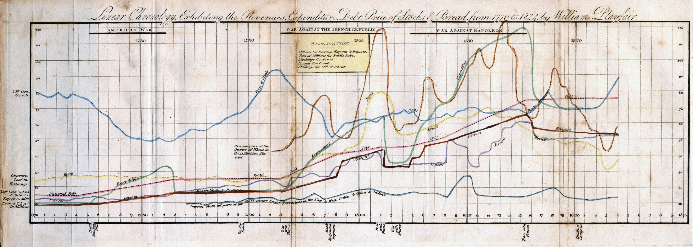

::: {.content-visible when-format="html"}
::: {#fig-playfair fig-cap="Uno de los primeros gráficos de barras de William Playfair (1786), mostrando el comercio de Inglaterra con varios países. Las barras negras representan exportaciones y las barras sombreadas importaciones." fig-alt="Gráfico de barras histórico: en el eje horizontal países como Dinamarca, Suecia, Rusia; en el vertical cantidades de comercio. Barras negras (exportaciones) y barras con rayas (importaciones) permiten comparar balanzas comerciales."}

:::
:::

::: {.content-visible when-format="pdf"}
::: {#fig-playfair-pdf fig-cap="Uno de los primeros gráficos de barras de William Playfair (1786), mostrando el comercio de Inglaterra con varios países."}
{width=0.6\textwidth}
:::
:::


## Objetivos de la lección

Al finalizar esta lección, los estudiantes serán capaces de:

- Elegir el gráfico adecuado (dispersión, puntos, histograma, caja) según el tipo de variable y el objetivo del análisis.
- Calcular e interpretar la media, mediana, desviación estándar y rango intercuartil (IQR).
- Describir la forma de una distribución (simétrica, asimétrica a derecha/izquierda, unimodal, bimodal).
- Identificar valores atípicos mediante el criterio de $1.5 \times IQR$ y explicar por qué a veces es útil transformar los datos.
- Distinguir entre estadísticos robustos (mediana, IQR) y no robustos (media, desviación estándar) y elegir cuál usar según la presencia de asimetría o valores extremos.

---

## Visualización de una variable numérica

### Gráfico de puntos (dot plot)
```{R}
#| label: fig-dotplot
#| fig.cap: "Gráfico de puntos (dot plot) de 50 ingresos simulados. Cada punto representa un valor."
#| echo: false
#| message: false
#| warning: false
#| fig-width: 6
#| fig-height: 4

library(ggplot2)
set.seed(123)
datos <- data.frame(ingreso = rnorm(50, mean = 500, sd = 100))
ggplot(datos, aes(x = ingreso)) +
  geom_dotplot(binwidth = 10, fill = "steelblue", color = "white") +
  labs(x = "Ingreso (miles de CLP)", y = "Conteo") +
  theme_minimal()
```
El gráfico de puntos muestra cada observación como un punto sobre una línea. Es útil para conjuntos pequeños porque no oculta valores y permite ver la densidad de los datos. Si se apilan puntos idénticos, se obtiene un **dot plot apilado**, que facilita ver la frecuencia de valores repetidos.

### Histograma

```{R}
#| label: fig-histograma
#| fig.cap: "Histograma de 500 ingresos simulados con distribución asimétrica a la derecha."
#| echo: false
#| message: false
#| warning: false
#| fig-width: 6
#| fig-height: 4

set.seed(123)
datos <- data.frame(ingreso = rlnorm(500, meanlog = 6, sdlog = 0.5))
ggplot(datos, aes(x = ingreso)) +
  geom_histogram(binwidth = 50, fill = "steelblue", color = "white", alpha = 0.8) +
  labs(x = "Ingreso (miles de CLP)", y = "Frecuencia") +
  theme_minimal()
```

El histograma agrupa los datos en intervalos (bins) y dibuja barras cuya altura representa la cantidad de observaciones en cada intervalo. Es ideal para muestras grandes y para apreciar la **forma general** de la distribución: simétrica, asimétrica a la derecha (cola larga hacia valores altos) o a la izquierda (cola larga hacia valores bajos). También permite identificar modas: **unimodal** (un pico prominente), **bimodal** (dos picos) o **multimodal** (más de dos picos).

### Diagrama de caja (box plot)

```{R}
#| label: fig-boxplot
#| fig.cap: "Diagrama de caja (box plot) de los mismos ingresos, mostrando mediana, cuartiles y valores atípicos."
#| echo: false
#| message: false
#| warning: false
#| fig-width: 4
#| fig-height: 5

set.seed(123)
datos <- data.frame(ingreso = rlnorm(100, meanlog = 6, sdlog = 0.6))
ggplot(datos, aes(y = ingreso)) +
  geom_boxplot(fill = "steelblue", color = "black", alpha = 0.7) +
  labs(y = "Ingreso (miles de CLP)") +
  theme_minimal()
```

El diagrama de caja resume cinco estadísticos: mínimo (o límite inferior de los bigotes), primer cuartil ($Q_1$), mediana, tercer cuartil (\(Q_3\)) y máximo (o límite superior de los bigotes). La caja contiene el 50% central de los datos. Los bigotes se extienden hasta el valor más extremo que no supere $1.5 \times IQR$ desde los cuartiles. Los puntos más allá de los bigotes se consideran **valores atípicos (outliers)**.

El box plot es muy útil para comparar distribuciones de varios grupos y para identificar rápidamente la presencia de asimetría y valores extremos.

### Diagrama de dispersión (scatterplot)

```{R}
#| label: fig-scatter
#| fig.cap: "Diagrama de dispersión entre años de educación e ingreso, mostrando una asociación positiva."
#| echo: false
#| message: false
#| warning: false
#| fig-width: 6
#| fig-height: 4

set.seed(123)
n <- 100
educacion <- runif(n, 6, 20)
ingreso <- 200 + 30 * educacion + rnorm(n, 0, 50)
datos <- data.frame(educacion, ingreso)
ggplot(datos, aes(x = educacion, y = ingreso)) +
  geom_point(color = "steelblue", alpha = 0.6) +
  geom_smooth(method = "lm", se = FALSE, color = "red", linetype = "dashed") +
  labs(x = "Años de educación", y = "Ingreso (miles de CLP)") +
  theme_minimal()
```

Cuando se tienen **dos variables numéricas**, el diagrama de dispersión es la herramienta principal. Cada punto representa un caso (individuo). Permite observar la dirección (positiva, negativa o nula), la fuerza y la forma (lineal, curvilínea, etc.) de la relación entre ambas variables.

---

## Medidas de centro

### Media ($\bar{x}$)

```{R}
#| label: fig-media-mediana
#| fig.cap: "Histograma con media (línea roja) y mediana (línea azul). La media es mayor que la mediana debido a la asimetría derecha."
#| echo: false
#| message: false
#| warning: false
#| fig-width: 6
#| fig-height: 4

set.seed(123)
datos <- data.frame(valor = rlnorm(500, meanlog = 2, sdlog = 0.8))
media <- mean(datos$valor)
mediana <- median(datos$valor)
ggplot(datos, aes(x = valor)) +
  geom_histogram(binwidth = 5, fill = "lightgray", color = "white") +
  geom_vline(xintercept = media, color = "red", linewidth = 1.2, linetype = "dashed") +
  geom_vline(xintercept = mediana, color = "blue", linewidth = 1.2, linetype = "dashed") +
  annotate("text", x = media + 10, y = 30, label = "Media", color = "red") +
  annotate("text", x = mediana - 15, y = 30, label = "Mediana", color = "blue") +
  labs(x = "Valor", y = "Frecuencia") +
  theme_minimal()
```

La media aritmética es la suma de todos los valores dividida por el número de observaciones. Es sensible a valores extremos (outliers) y a la asimetría de la distribución. Se representa con $\bar{x}$ para una muestra y con $\mu$ para la población.

### Mediana ($M$)

La mediana es el valor central cuando los datos se ordenan de menor a mayor. Si hay un número par de observaciones, se promedian los dos centrales. La mediana es **robusta**: no se ve afectada por outliers ni por asimetrías extremas. Por ello, cuando la distribución es asimétrica, la mediana suele ser una mejor representación del “valor típico” que la media.

---

## Medidas de dispersión

### Desviación estándar ($s$)

```{R}
#| label: fig-desviacion
#| fig.cap: 'Histograma con bandas de una desviación estándar alrededor de la media ($\pm1\sigma$).'
#| echo: false
#| message: false
#| warning: false
#| fig-width: 6
#| fig-height: 4

set.seed(123)
datos <- data.frame(valor = rnorm(500, mean = 100, sd = 15))
media <- mean(datos$valor)
sd_ <- sd(datos$valor)
ggplot(datos, aes(x = valor)) +
  geom_histogram(binwidth = 5, fill = "lightgray", color = "white") +
  geom_vline(xintercept = media, color = "red", linewidth = 1.2) +
  geom_vline(xintercept = media - sd_, color = "blue", linetype = "dashed") +
  geom_vline(xintercept = media + sd_, color = "blue", linetype = "dashed") +
  annotate("text", x = media, y = 30, label = "Media", color = "red") +
  annotate("text", x = media - sd_ - 8, y = 30, label = "-1 sigma", color = "blue") +
  annotate("text", x = media + sd_ + 8, y = 30, label = "+1 sigma", color = "blue") +
  labs(x = "Valor", y = "Frecuencia") +
  theme_minimal()
```

La desviación estándar mide la distancia típica de las observaciones respecto a la media. Se calcula como la raíz cuadrada de la varianza ($s^2$), que es el promedio de los cuadrados de las desviaciones respecto a la media (dividiendo por \(n-1\) en una muestra). Al igual que la media, la desviación estándar es **sensible a outliers** y a la asimetría.

### Rango intercuartil (IQR)

```{R}
#| label: fig-iqr
#| fig.cap: "Box plot donde la caja representa el IQR (entre Q1 y Q3), y los bigotes se extienden hasta 1.5*IQR."
#| echo: false
#| message: false
#| warning: false
#| fig-width: 4
#| fig-height: 5

set.seed(123)
datos <- data.frame(valor = rnorm(100, mean = 100, sd = 20))
ggplot(datos, aes(y = valor)) +
  geom_boxplot(fill = "steelblue", alpha = 0.7) +
  labs(y = "Valor") +
  theme_minimal()
```

El IQR es la distancia entre el tercer y el primer cuartil ($IQR = Q_3 - Q_1$). Representa la dispersión del 50% central de los datos. Es **robusto** porque no se ve influido por valores extremos. Se usa también para detectar outliers: se considera atípico cualquier valor menor que $Q_{1} - 1.5 \times IQR$ o mayor que $Q_{3} + 1.5 \times IQR$.

---

## Forma de la distribución

La forma de una distribución se describe mediante:

- **Asimetría (skewness):**
  - *Sesgada a la derecha* (cola larga hacia la derecha): media > mediana.
  - *Sesgada a la izquierda* (cola larga hacia la izquierda): media < mediana.
  - *Simétrica*: media ≈ mediana.

```{R}
#| label: fig-asimetriad
#| fig.cap: "Distribución con asimetría positiva (cola larga a la derecha)."
#| echo: false
#| message: false
#| warning: false
#| fig-width: 6
#| fig-height: 4

set.seed(123)
datos <- data.frame(valor = rlnorm(500, meanlog = 2, sdlog = 0.8))
ggplot(datos, aes(x = valor)) +
  geom_histogram(binwidth = 10, fill = "steelblue", color = "white", alpha = 0.8) +
  labs(x = "Valor", y = "Frecuencia") +
  theme_minimal()
```

```{R}
#| label: fig-asimetriai
#| fig.cap: "Distribución con asimetría negativa (cola larga a la izquierda)."
#| echo: false
#| message: false
#| warning: false
#| fig-width: 6
#| fig-height: 4

set.seed(123)
# Generar datos con sesgo izquierdo: reflejar una distribución lognormal
datos <- data.frame(valor = -rlnorm(500, meanlog = 2, sdlog = 0.8) + 100)
ggplot(datos, aes(x = valor)) +
  geom_histogram(binwidth = 5, fill = "steelblue", color = "white", alpha = 0.8) +
  labs(x = "Valor", y = "Frecuencia") +
  theme_minimal()
```

- **Modalidad:**
  - Unimodal: un pico claro.
  - Bimodal: dos picos.
  - Multimodal: más de dos picos.

```{R}
#| label: fig-modalidad
#| fig.cap: "Distribución bimodal (dos picos)."
#| echo: false
#| message: false
#| warning: false
#| fig-width: 6
#| fig-height: 4

set.seed(123)
moda1 <- rnorm(300, mean = 50, sd = 10)
moda2 <- rnorm(300, mean = 100, sd = 10)
datos <- data.frame(valor = c(moda1, moda2))
ggplot(datos, aes(x = valor)) +
  geom_histogram(binwidth = 5, fill = "steelblue", color = "white", alpha = 0.8) +
  labs(x = "Valor", y = "Frecuencia") +
  theme_minimal()
```

Conocer la forma ayuda a decidir qué estadísticos usar y si es necesario transformar los datos (por ejemplo, aplicar logaritmo para reducir la asimetría derecha).

---

## Valores atípicos (outliers) y estadísticos robustos

Un valor atípico es una observación que se aleja notablemente del resto. Puede deberse a errores de medición, a una rareza genuina o a la naturaleza de la variable. En cualquier caso, es importante identificarlos porque pueden distorsionar la media y la desviación estándar.

- **Estadísticos robustos** (resistentes a outliers): mediana, IQR.
- **Estadísticos no robustos** (sensibles a outliers): media, desviación estándar.

En presencia de outliers o asimetría fuerte, se recomienda usar la mediana y el IQR para describir el centro y la dispersión típicos.

```{R}
#| label: fig-outliers
#| fig.cap: "Box plot que muestra tres valores atípicos (puntos fuera de los bigotes). La mediana y el IQR son robustos, la media y la desviación estándar son sensibles."
#| echo: false
#| message: false
#| warning: false
#| fig-width: 4
#| fig-height: 5

set.seed(123)
datos <- c(rnorm(100, mean = 100, sd = 15), 200, 210, 250)
datos <- data.frame(valor = datos)
ggplot(datos, aes(y = valor)) +
  geom_boxplot(fill = "steelblue", alpha = 0.7) +
  labs(y = "Valor") +
  theme_minimal()
```
---

## Transformaciones y mapas de intensidad

Cuando una variable tiene una asimetría muy pronunciada (por ejemplo, población de condados), aplicar una transformación como el logaritmo (base 10) puede convertir la distribución en aproximadamente simétrica, facilitando su modelización y visualización. También se pueden transformar una o ambas variables en un diagrama de dispersión para revelar patrones ocultos.

Los **mapas de intensidad** (mapas coropléticos) representan valores de una variable numérica sobre un mapa geográfico mediante colores. Son muy útiles para detectar patrones espaciales (ej. regiones con alta pobreza o bajo ingreso).

```{R}
#| label: fig-transformaciones
#| fig.cap: "Comparación de un histograma original (arriba, fuertemente asimétrico) y su transformación logarítmica (abajo, aproximadamente simétrico)."
#| echo: false
#| message: false
#| warning: false
#| fig-width: 6
#| fig-height: 6

library(patchwork)
set.seed(123)
datos <- data.frame(original = rlnorm(500, meanlog = 2, sdlog = 0.9))
datos$log <- log(datos$original)

p1 <- ggplot(datos, aes(x = original)) +
  geom_histogram(binwidth = 20, fill = "steelblue", color = "white") +
  labs(x = "Valor original", y = "Frecuencia") +
  theme_minimal()

p2 <- ggplot(datos, aes(x = log)) +
  geom_histogram(binwidth = 0.2, fill = "steelblue", color = "white") +
  labs(x = "Logaritmo del valor", y = "Frecuencia") +
  theme_minimal()

p1 / p2
```

```{R}
#| label: fig-mapa
#| fig.cap: "Mapa de intensidad (coroplético) que muestra una variable hipotética (por ejemplo, ingreso promedio) por estado de EE.UU."
#| echo: false
#| message: false
#| warning: false
#| fig-width: 8
#| fig-height: 5

library(ggplot2)
library(dplyr)
mapa <- map_data("state")
set.seed(123)
estados <- unique(mapa$region)
valor <- runif(length(estados), 0, 100)
datos_estados <- data.frame(region = estados, valor = valor)
mapa <- mapa %>% left_join(datos_estados, by = "region")
ggplot(mapa, aes(x = long, y = lat, group = group, fill = valor)) +
  geom_polygon(color = "white", size = 0.1) +
  scale_fill_gradient(low = "lightyellow", high = "darkred", name = "Valor") +
  theme_void() +
  labs(fill = "Indicador") +
  theme(legend.position = "bottom")
```

```{R}
#| label: fig-mapa-chile
#| fig.cap: "Mapa de intensidad (coroplético) de Chile mostrando una variable hipotética (por ejemplo, ingreso promedio) por región."
#| echo: false
#| message: false
#| warning: false
#| fig-width: 6
#| fig-height: 8

library(ggplot2)
library(dplyr)
library(chilemapas)

# Cargar mapa de regiones
mapa_regiones <- generar_regiones()

# Datos hipotéticos: una variable por región (ej. ingreso promedio)
set.seed(123)
regiones_unicas <- unique(mapa_regiones$codigo_region)
valor <- runif(length(regiones_unicas), 30, 90)  # valores entre 30 y 90
datos_regiones <- data.frame(
  codigo_region = regiones_unicas,
  valor = round(valor, 1)
)

# Unir datos al mapa
mapa_regiones <- mapa_regiones %>%
  left_join(datos_regiones, by = "codigo_region")

# Graficar
ggplot(mapa_regiones) +
  geom_sf(aes(fill = valor), color = "white", size = 0.2) +
  scale_fill_gradient(low = "lightyellow", high = "darkred", name = "Valor hipotético") +
  labs(title = "Variable hipotética por región") +
  theme_void() +
  theme(legend.position = "bottom",
        plot.title = element_text(hjust = 0.5, face = "bold"))
```
---

## Material de apoyo y reforzamiento

Para complementar tu estudio, aquí tienes recursos adicionales, esta vez centrados en **ejemplos propios de la ingeniería**. A través de ellos podrás ver cómo los conceptos de diseño experimental, placebo y sistemas complejos se aplican en contextos tecnológicos y de simulación.

### Mapa mental

Para consolidar los conceptos de la lección, aquí tienes un mapa mental que integra visualmente los principales temas tratados: visualización, centro, dispersión, forma, valores atípicos y estadísticos robustos.

{#fig-mapa-leccion6-resumen fig-alt="Mapa mental completo sobre el análisis de datos numéricos."}

### Documento PDF

El siguiente documento aborda el **diagnóstico de sistemas complejos** desde una perspectiva ingenieril, ideal para entender cómo se planifican experimentos en entornos con múltiples variables interactuantes.

- [Diagnóstico de Sistemas Complejos (PDF)](/epdi/media/Diagnóstico_de_Sistemas_Complejos.pdf)

### Video complementario

Este video retoma el dilema ético del **placebo en el quirófano**, pero ahora analizado desde la ingeniería biomédica y el diseño de dispositivos médicos. Resulta especialmente útil para reflexionar sobre cómo los principios de cegamiento y grupo de control se trasladan a la experimentación tecnológica.

- [Entendiendo los datos (video)](/epdi/media/Entendiendo_los_datos.mp4)

---

## Cuestionario Grupal (Portafolio): Lección 6 Exploración de datos numéricos

1. **Comparación de centro y dispersión**
   Se tienen dos conjuntos de datos:
   A = {3, 5, 6, 7, 9}
   B = {3, 5, 6, 7, 20}
   Calcula mentalmente (o con cálculos simples) la mediana y la media de cada conjunto. Explica cómo la presencia del valor 20 en B afecta a la media y a la mediana. ¿Qué medida de centro recomendarías para describir un conjunto como B? ¿Por qué? ¿Qué ocurre con la desviación estándar y el IQR al comparar A con B? ¿Cuál de las dos medidas de dispersión es más robusta? Argumenta.

2. **Interpretación de un histograma**
   El histograma  de la @fig-hist-ingresos muestra la distribución de los ingresos mensuales (en miles de pesos) de los habitantes de una comuna. La mayoría de los ingresos se concentran entre 300 y 800, pero hay una cola larga hacia la derecha que llega hasta 2500. Basándote únicamente en esta descripción, ¿esperarías que la media sea mayor o menor que la mediana? ¿Por qué? ¿Qué medida de centro usarías para informar el “ingreso típico” de la comuna? Justifica. Si además se sabe que hay algunos ingresos negativos (por errores de digitación), ¿cómo afectaría eso a la media y a la mediana? ¿Qué harías con esos valores?

```{R}
#| label: fig-hist-ingresos
#| fig.cap: "Distribución de ingresos mensuales (en miles de pesos) de los habitantes de una comuna. La mayoría se concentra entre 300 y 800, con una cola larga hasta 2500."
#| echo: false
#| message: false
#| warning: false
#| fig-width: 8
#| fig-height: 5
#| fig-align: center

library(ggplot2)
set.seed(2026)

n <- 5000
ingresos_principales <- rnorm(n * 0.95, mean = 550, sd = 120)
ingresos_principales <- ingresos_principales[ingresos_principales >= 300 & ingresos_principales <= 800]
cola_derecha <- rexp(n * 0.05, rate = 1/400) + 800
cola_derecha <- cola_derecha[cola_derecha <= 2500]
ingresos <- c(ingresos_principales, cola_derecha)
if(length(ingresos) > n) ingresos <- ingresos[1:n]

datos <- data.frame(ingreso = ingresos)

ggplot(datos, aes(x = ingreso)) +
  geom_histogram(binwidth = 50, fill = "steelblue", color = "white", alpha = 0.8) +
  scale_x_continuous(breaks = seq(0, 2500, 250), limits = c(0, 2600)) +
  labs(x = "Ingreso (miles de CLP)", y = "Frecuencia") +
  theme_minimal(base_size = 12) +
  theme(plot.title = element_text(face = "bold", hjust = 0.5))
```

3. **Detección de outliers mediante box plot**
   Se ha construido un diagrama de caja para las edades de los participantes de un estudio. El box plot muestra: $Q_1 = 25$ años, mediana = 32 años, \(Q_3 = 40\) años. El bigote inferior llega hasta 18 años y el superior hasta 58 años. Además, hay dos puntos señalados como outliers: uno a los 12 años y otro a los 82 años.
   - Calcula el IQR y los límites para considerar un valor atípico. Verifica que efectivamente 12 y 82 son outliers según el criterio de $1.5 \times IQR$.
   - ¿Qué significado práctico podría tener que haya un participante de 12 años en un estudio de adultos? ¿Y uno de 82 años? ¿Descartarías esos valores automáticamente? ¿Por qué sí o por qué no?

4. **Forma de la distribución y elección de estadísticos**
   Se quiere analizar el número de horas semanales que estudiantes de enseñanza media dedican a usar redes sociales. Se sospecha que la mayoría dedica pocas horas (entre 0 y 5), algunos dedican entre 6 y 15, y unos pocos dedican más de 20 horas. ¿Qué forma esperarías que tenga esta distribución? Dibuja mentalmente su forma. ¿Recomendarías usar la media o la mediana para resumir el centro? ¿Y la desviación estándar o el IQR para la variabilidad? Explica en cada caso tu razonamiento, vinculándolo con la robustez de los estadísticos.

5. **Aplicación de transformación logarítmica**
   En un estudio sobre ingresos de hogares en Chile, se obtiene una distribución fuertemente sesgada a la derecha, con unos pocos hogares de ingresos extremadamente altos. Los investigadores deciden aplicar una transformación logarítmica (base 10) a los datos.
   - ¿Qué efecto tendrá esta transformación sobre la forma de la distribución? ¿Por qué es útil?
   - Después de la transformación, ¿cómo se interpretaría la media de los log‑ingresos? ¿Podrías convertirla de nuevo a la escala original (por ejemplo, promediando los antilogaritmos)? ¿Por qué sí o por qué no?
   - ¿Qué ventaja tiene analizar los datos transformados cuando se quiere ajustar un modelo estadístico?

---

**Nota final:** Aunque en esta lección no hemos utilizado R, todos estos conceptos se aplican directamente en el análisis de datos reales. En las próximas sesiones pondremos en práctica estas ideas con conjuntos de datos concretos.
