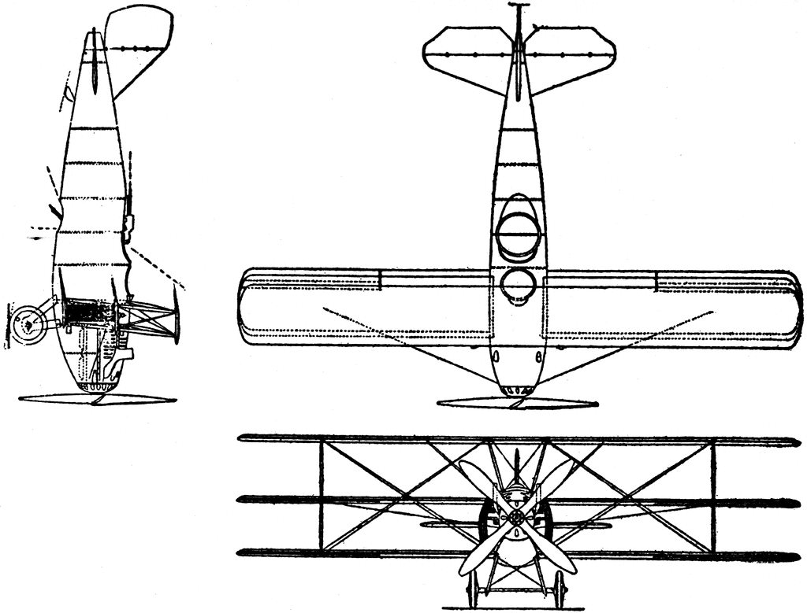

::: {.content-visible when-format="html"}
::: {#fig-curtis-triplane fig-cap="Tres vistas del triplano Curtis Model 18-I. Este avión experimental estaba equipado con un motor K-12 de 400 caballos de fuerza." fig-alt="Ilustración que muestra tres vistas (frontal, lateral y superior) de un triplano Curtis Model 18-I. Se aprecian sus tres pares de alas, la hélice y el fuselaje alargado."}

:::
:::

::: {.content-visible when-format="pdf"}
::: {#fig-curtis-triplane-pdf fig-cap="Tres vistas del triplano Curtis Model 18-I, un avión experimental con motor de 400 HP."}
{width=0.6\textwidth}
:::
:::

## Objetivos de la lección

Al finalizar esta lección, serás capaz de:

- Construir e interpretar **tablas de contingencia** para dos variables categóricas.
- Calcular e interpretar **proporciones por fila** y **proporciones por columna**.
- Elegir el gráfico más adecuado (barras apiladas, side‑by‑side, estandarizadas, mosaico) según el tipo de pregunta.
- Utilizar **gráficos de mosaico** para visualizar asociaciones.
- Comparar distribuciones numéricas entre grupos mediante **box plots** y **histogramas huecos**.

---

## Tablas de contingencia: la herramienta básica

Cuando se estudia la relación entre dos variables categóricas, la herramienta fundamental es la **tabla de contingencia**. Esta tabla muestra, en cada celda, el número de observaciones que pertenecen simultáneamente a una categoría de la primera variable y a una categoría de la segunda.

**Ejemplo aeronáutico:**
Se ha registrado información sobre 500 pilotos comerciales. Se quiere saber si existe relación entre el **tipo de licencia** (comercial, privada, militar) y la **preferencia de aeronave** para vuelos de largo alcance (monomotor, multimotor, jet). La tabla de contingencia resume los datos.

|                | Monomotor | Multimotor | Jet | Total |
|----------------|-----------|------------|-----|-------|
| Licencia comercial | 45        | 112        | 83  | 240   |
| Licencia privada   | 78        | 34         | 12  | 124   |
| Licencia militar   | 22        | 68         | 46  | 136   |
| **Total**          | 145       | 214        | 141 | 500   |

- Cada celda (ej. 45) es el número de pilotos con licencia comercial que prefieren monomotor.
- Los totales por fila y columna permiten calcular porcentajes.

---

## Proporciones por fila y por columna

Las tablas de contingencia se pueden transformar en tablas de **proporciones** para facilitar la comparación entre grupos. Existen dos enfoques principales:

- **Proporciones por fila:** dividir cada celda por el total de su fila. Responden a la pregunta: *“dentro de cada nivel de la variable explicativa, ¿cómo se distribuye la variable respuesta?”*
- **Proporciones por columna:** dividir cada celda por el total de su columna. Responden a la pregunta: *“dentro de cada nivel de la variable respuesta, ¿cómo se distribuye la variable explicativa?”*

**Continuación del ejemplo:**
Si consideramos que el tipo de licencia puede influir en la preferencia de aeronave, la variable explicativa sería *licencia*. Entonces las **proporciones por fila** son más útiles:

|                | Monomotor | Multimotor | Jet | Total |
|----------------|-----------|------------|-----|-------|
| Comercial      | 0.188     | 0.467      | 0.346| 1.000 |
| Privada        | 0.629     | 0.274      | 0.097| 1.000 |
| Militar        | 0.162     | 0.500      | 0.338| 1.000 |

Interpretación: el 46,7% de los pilotos con licencia comercial prefieren multimotor, mientras que solo el 27,4% de los pilotos con licencia privada eligen ese tipo. Estas diferencias sugieren una **asociación** entre licencia y preferencia.

> **Regla práctica:** cuando existe una relación clara de “explicativa → respuesta”, es mejor usar proporciones por fila (condicionar en la explicativa).

---

## Gráficos de barras para dos variables

Las tablas de contingencia se visualizan mediante gráficos de barras. Existen tres variantes principales.

### Barras apiladas (stacked)

Se dibuja una barra para cada nivel de la variable principal, y dentro de cada barra se apilan los segmentos correspondientes a los niveles de la segunda variable. Es útil cuando hay una variable explicativa clara.

```{R}
#| label: fig-stacked-bar
#| fig.cap: "Barras apiladas: distribución de incidentes por causa según tipo de operación. Cada barra representa el total de incidentes en cada tipo de operación, y los colores muestran la contribución de cada causa."
#| echo: false
#| message: false
#| warning: false
#| fig-width: 7
#| fig-height: 5

library(ggplot2)
library(dplyr)

# Datos simulados
datos <- data.frame(
  operacion = rep(c("Comercial", "Militar", "Privada"), each = 3),
  causa = rep(c("Factor humano", "Fallo mecánico", "Meteorología"), times = 3),
  frecuencia = c(45, 30, 15,   # Comercial
                 60, 40, 10,   # Militar
                 25, 15, 20)   # Privada
)

ggplot(datos, aes(x = operacion, y = frecuencia, fill = causa)) +
  geom_bar(stat = "identity", position = "stack") +
  labs(x = "Tipo de operación", y = "Número de incidentes", fill = "Causa") +
  theme_minimal()
```

### Barras lado a lado (side‑by‑side)

Las barras de cada nivel de la variable principal se colocan una al lado de la otra, agrupadas por categoría de la segunda variable. Permite comparar fácilmente las alturas de las barras, pero requiere más espacio horizontal.


```{R}
#| label: fig-side-by-side
#| fig.cap: "Barras lado a lado: comparación de frecuencias de causas de incidentes entre tipos de operación. Facilita la comparación directa entre grupos."
#| echo: false
#| message: false
#| warning: false
#| fig-width: 8
#| fig-height: 5

ggplot(datos, aes(x = operacion, y = frecuencia, fill = causa)) +
  geom_bar(stat = "identity", position = "dodge") +
  labs(x = "Tipo de operación", y = "Número de incidentes", fill = "Causa") +
  theme_minimal()
```

### Barras apiladas estandarizadas

Cada barra tiene la misma altura (1 o 100%), y los segmentos representan proporciones. Son ideales cuando los tamaños de los grupos son muy desiguales, porque la estandarización facilita la comparación de patrones. La desventaja es que se pierde información sobre el tamaño absoluto de cada grupo.

**Ejemplo en aviación:**
En un estudio sobre **causas de incidentes** (factor humano, mecánico, climático) en tres fases del vuelo (despegue, crucero, aterrizaje), si las frecuencias de incidentes son muy diferentes entre fases, el gráfico apilado estandarizado revela si la distribución de causas varía de una fase a otra.


```{R}
#| label: fig-stacked-standardized
#| fig.cap: "Barras apiladas estandarizadas: proporciones de causas dentro de cada tipo de operación. Útil cuando los totales por grupo son muy desiguales."
#| echo: false
#| message: false
#| warning: false
#| fig-width: 7
#| fig-height: 5

ggplot(datos, aes(x = operacion, y = frecuencia, fill = causa)) +
  geom_bar(stat = "identity", position = "fill") +
  labs(x = "Tipo de operación", y = "Proporción", fill = "Causa") +
  scale_y_continuous(labels = scales::percent) +
  theme_minimal()
```

---

## Gráficos de mosaico

Un **gráfico de mosaico** es una alternativa más compacta y elegante que el apilado estandarizado. El área total se divide primero en columnas cuyo ancho es proporcional al tamaño de cada categoría de la variable principal. Luego, cada columna se subdivide verticalmente según las proporciones de la segunda variable.

**Ventaja:** mantiene la información sobre los tamaños relativos de los grupos (el ancho de las columnas) y, al mismo tiempo, muestra las proporciones internas.

**Interpretación:** si la línea de división interna en las distintas columnas se mantiene aproximadamente horizontal, las variables son independientes. Si la línea sube o baja sistemáticamente, hay asociación.


```{R}
#| label: fig-mosaic-one
#| fig.cap: "Mosaico de una variable: muestra la proporción de cada tipo de operación en el total de incidentes. El ancho de cada columna es proporcional a la frecuencia."
#| echo: false
#| message: false
#| warning: false
#| fig-width: 6
#| fig-height: 4

library(vcd)

# Datos para mosaico de una variable (solo operación)
datos_una <- data.frame(operacion = rep(c("Comercial", "Militar", "Privada"),
                                        times = c(90, 110, 60)))

# Tabla de frecuencias
tabla_una <- table(datos_una$operacion)

# Mosaico de una variable
mosaic(~ operacion, data = datos_una,
       xlab = "Tipo de operación", ylab = "Proporción",
       main = "")
```

```{R}
#| label: fig-mosaic-two
#| fig.cap: "Mosaico de dos variables: relación entre tipo de operación y causa de incidente. El ancho de las columnas representa la frecuencia de cada operación; la altura de los rectángulos dentro de cada columna representa la proporción de cada causa."
#| echo: false
#| message: false
#| warning: false
#| fig-width: 8
#| fig-height: 5

library(vcd)

# Datos de frecuencias (mismos que en los gráficos de barras)
datos <- data.frame(
  operacion = rep(c("Comercial", "Militar", "Privada"), each = 3),
  causa = rep(c("Factor humano", "Fallo mecánico", "Meteorología"), times = 3),
  frecuencia = c(45, 30, 15,   # Comercial
                 60, 40, 10,   # Militar
                 25, 15, 20)   # Privada
)

# Convertir a tabla de contingencia
tabla <- xtabs(frecuencia ~ operacion + causa, data = datos)

# Mosaico
mosaic(tabla,
       shade = TRUE,               # colorea según residuos
       legend = TRUE,              # muestra leyenda
       main = "",                  # sin título extra
       xlab = "Tipo de operación",
       ylab = "Causa")
```

```{R}
#| label: fig-pie-vs-bar
#| fig.cap: "Comparación entre un gráfico circular y un gráfico de barras para la misma variable (distribución de incidentes según causa). Los gráficos circulares pueden ser útiles para ofrecer una visión general de cómo se distribuye un conjunto de casos. Sin embargo, también es difícil descifrar detalles en un gráfico circular. Por ejemplo, cuesta unos segundos más reconocer que la causa 'Factor humano' es más frecuente que 'Fallo mecánico' cuando se mira el gráfico circular, mientras que este detalle es muy obvio en el gráfico de barras. Si bien los gráficos circulares pueden ser útiles, preferimos los gráficos de barras por su facilidad para comparar grupos."
#| echo: false
#| message: false
#| warning: false
#| fig-width: 10
#| fig-height: 5

library(patchwork)

# Datos de ejemplo
causas <- data.frame(
  causa = c("Factor humano", "Fallo mecánico", "Meteorología"),
  frecuencia = c(130, 85, 45)
)

# Gráfico circular
p_pie <- ggplot(causas, aes(x = "", y = frecuencia, fill = causa)) +
  geom_bar(stat = "identity", width = 1) +
  coord_polar(theta = "y") +
  labs(title = "Gráfico circular") +
  theme_void() +
  theme(legend.position = "bottom")

# Gráfico de barras
p_bar <- ggplot(causas, aes(x = causa, y = frecuencia, fill = causa)) +
  geom_bar(stat = "identity") +
  labs(title = "Gráfico de barras", x = "Causa", y = "Frecuencia") +
  theme_minimal() +
  theme(legend.position = "none")

# Unir ambos
p_pie + p_bar
```

---

## Comparación de datos numéricos entre grupos

A veces interesa comparar una **variable numérica** (ej. horas de vuelo) entre dos o más grupos definidos por una variable categórica (ej. tipo de licencia). Las herramientas más comunes son:

- **Diagramas de caja (box plots) lado a lado:** permiten comparar medianas, dispersión (IQR) y detectar valores atípicos en cada grupo.
- **Histogramas huecos (hollow histograms):** se superponen los contornos de varios histogramas en una misma gráfica. Son útiles para comparar forma, centro y dispersión cuando los grupos tienen tamaños muy diferentes.

**Ejemplo:**
Se desea comparar las **horas totales de vuelo** de pilotos comerciales según su lugar de entrenamiento (academia civil, fuerza aérea, escuela privada). Un box plot lado a lado mostraría rápidamente si la mediana de horas difiere entre los grupos y si algún grupo presenta valores extremos.


```{R}
#| label: fig-boxplot-group
#| fig.cap: "Diagramas de caja lado a lado: comparación de las horas de vuelo (miles) de pilotos según el tipo de operación. Se aprecian medianas, rango intercuartil y posibles valores atípicos."
#| echo: false
#| message: false
#| warning: false
#| fig-width: 6
#| fig-height: 5

set.seed(123)
datos_horas <- data.frame(
  operacion = rep(c("Comercial", "Militar", "Privada"), each = 50),
  horas_vuelo = c(rnorm(50, mean = 8, sd = 1.5),
                  rnorm(50, mean = 10, sd = 2.0),
                  rnorm(50, mean = 4, sd = 1.2))
)

ggplot(datos_horas, aes(x = operacion, y = horas_vuelo, fill = operacion)) +
  geom_boxplot() +
  labs(x = "Tipo de operación", y = "Horas de vuelo (miles)") +
  theme_minimal() +
  theme(legend.position = "none")
```

```{R}
#| label: fig-hollow-hist
#| fig.cap: "Histogramas huecos (contornos) de las horas de vuelo para los tres tipos de operación. Permiten comparar forma, centro y dispersión incluso cuando los tamaños de grupo son desiguales."
#| echo: false
#| message: false
#| warning: false
#| fig-width: 7
#| fig-height: 5

library(ggplot2)

# Datos simulados con tamaños desiguales
set.seed(123)
datos_desiguales <- data.frame(
  operacion = rep(c("Comercial", "Militar", "Privada"),
                  times = c(100, 30, 80)),
  horas_vuelo = c(rnorm(100, mean = 8, sd = 1.5),
                  rnorm(30, mean = 10, sd = 2.0),
                  rnorm(80, mean = 4, sd = 1.2))
)

ggplot(datos_desiguales, aes(x = horas_vuelo, color = operacion)) +
  geom_freqpoly(binwidth = 0.5, linewidth = 1.2) +
  labs(x = "Horas de vuelo (miles)", y = "Conteo", color = "Operación") +
  theme_minimal()
```
---

## Material de apoyo y reforzamiento

Para complementar tu estudio de los **datos categóricos**, aquí tienes recursos especialmente diseñados para el ámbito aeronáutico. A través de ellos podrás ver cómo se aplican las tablas de contingencia, los gráficos de barras y los diagramas de mosaico en contextos reales de pilotaje comercial y fuerza aérea.

### Mapa mental

Consolida los conceptos clave de la lección con este mapa mental que integra visualmente: tablas de contingencia, gráficos de barras (apilados, lado a lado, estandarizados), gráficos de mosaico, comparación de grupos mediante diagramas de caja e histogramas huecos.

{#fig-mapa-leccion7 fig-alt="Mapa mental que organiza los conceptos de tablas de contingencia, proporciones por fila y columna, tipos de gráficos de barras, gráficos de mosaico, y métodos para comparar distribuciones numéricas entre grupos (box plots, histogramas huecos)."}

### Presentación en PDF

El siguiente documento, **Aviation_Categorical_Mastery.pdf**, está centrado en ejemplos del área aeronáutica. Explora variables categóricas como tipo de licencia (comercial, privada, militar) y horas de vuelo registradas. Incluye tablas de contingencia, gráficos de barras apiladas para visualizar la distribución de estas categorías, y diagramas de mosaico para representar la relación entre distintos tipos de licencias aéreas.

- [Aviation_Categorical_Mastery.pdf](/epdi/media/Aviation_Categorical_Mastery.pdf)

### Video complementario

El video **Datos_Categóricos.mp4** presenta una exposición con ejemplos prácticos de pilotaje comercial y fuerza aérea. Muestra cómo crear e interpretar tablas de contingencia para comparar licencias comerciales y militares, cómo construir gráficos de barras apiladas y cómo utilizar diagramas de mosaico para analizar la relación entre variables categóricas en el contexto de la aviación.

- [Datos_Categóricos (video)](/epdi/media/Datos_Categóricos.mp4)

::: {.callout-note}
**Discrepancia en el material generado por IA**

El video *Datos_Categóricos.mp4* fue solicitado a NotebookLM con instrucciones explícitas de usar ejemplos del área aeronáutica (pilotos comerciales, fuerza aérea, tipos de licencia, horas de vuelo). Sin embargo, el video generado muestra ejemplos basados en **préstamos bancarios** (tablas de contingencia sobre solicitudes de crédito), no en aviación.

Esta discrepancia es intencionalmente dejada para que reflexionemos sobre un punto crucial de la **Defensa Final de EPDI**: las herramientas de IA pueden producir resultados que no se ajustan completamente a las instrucciones, contener sesgos o presentar información errónea. Aprender a **detectar, verificar y corregir** estos errores es parte fundamental del pensamiento crítico y del uso responsable de la inteligencia artificial.

Te invito a identificar las diferencias entre lo solicitado y lo entregado, y a pensar cómo podrías haber mejorado el prompt para obtener un resultado más apegado al contexto aeronáutico.
:::

---

## Cuestionario Grupal (Portafolio): Lección 7 Análisis de datos categóricos

Responde cada pregunta en un párrafo de al menos 5 líneas, utilizando los conceptos de la lección.

1. **Tablas de contingencia y proporciones**
   Se ha registrado la relación entre el **uso de checklist electrónico** (sí/no) y la **ocurrencia de errores en procedimientos de emergencia** (sí/no) en 320 simulacros de vuelo. Los resultados son:
   - Con checklist y sin error: 112
   - Con checklist y con error: 48
   - Sin checklist y sin error: 64
   - Sin checklist y con error: 96

   Construye la tabla de contingencia completa (incluyendo totales). Calcula las proporciones por fila y por columna. ¿Qué proporción consideras más informativa para determinar si el uso de checklist reduce los errores? Justifica tu elección y explica qué conclusión obtienes.

2. **Gráficos de barras y mosaico**
   En una investigación sobre **incidentes en vuelo**, se clasificaron 200 eventos según la **causa principal** (factor humano, fallo mecánico, meteorología) y el **tipo de operación** (comercial, militar, privada). Se quiere visualizar la asociación entre ambas variables.
   - ¿Qué gráfico (apilado, side‑by‑side, apilado estandarizado o mosaico) recomendarías si los tamaños de los tres tipos de operación son muy desiguales? ¿Por qué?
   - ¿Qué ventaja adicional tiene el gráfico de mosaico sobre el apilado estandarizado?

3. **Comparación de grupos**
   Un centro de entrenamiento de pilotos desea saber si los **años de experiencia** de sus instructores difieren según la rama de origen (fuerza aérea, aerolínea comercial, escuela civil). Se dispone de una muestra de 60 instructores, con 20 de cada rama.
   - ¿Qué dos gráficos utilizarías para comparar las distribuciones de experiencia entre los tres grupos? Describe qué aspectos de las distribuciones podrías evaluar con cada uno.
   - ¿Qué información se obtiene de un box plot que no se ve en un histograma hueco, y viceversa?

4. **Independencia vs. asociación**
   En un estudio sobre 500 pilotos, se cruza la variable **tipo de visión nocturna** (normal, corregida con lentes, cirugía refractiva) con la variable **aprobación de vuelo nocturno** (aprueba, no aprueba). La tabla de proporciones por columna muestra que, dentro de los que aprueban, el 50% tiene visión normal, 30% lentes y 20% cirugía; mientras que entre los que no aprueban, los porcentajes son 20%, 50% y 30% respectivamente.
   - ¿Existe asociación entre las variables? Explica cómo lo sabes.
   - Si los tamaños de los grupos de aprobación fueran muy diferentes (por ejemplo, 450 aprueban y 50 no aprueban), ¿qué gráfico sería más adecuado para visualizar esta asociación y por qué?

5. **Aplicación a datos reales (hipotéticos)**
   La Fuerza Aérea de un país registró la relación entre el **rango** (oficial, suboficial, tropa) y la **especialidad** (piloto, navegante, ingeniero de vuelo, controlador). Se sospecha que la distribución de especialidades es diferente según el rango.
   - Propón un plan de análisis: ¿qué tabla o gráfico construirías primero y qué tipo de proporciones calcularías?
   - Si encontraras una asociación, ¿podrías afirmar que el rango *causa* la elección de especialidad? ¿Por qué sí o por qué no?

---

**Nota final:** Los gráficos mencionados (barras, mosaicos, box plots) no se generan con código R en esta lección, pero todos ellos se pueden producir fácilmente con los paquetes `ggplot2`, `ggmosaic`, etc. En sesiones prácticas futuras los construiremos con datos reales.
