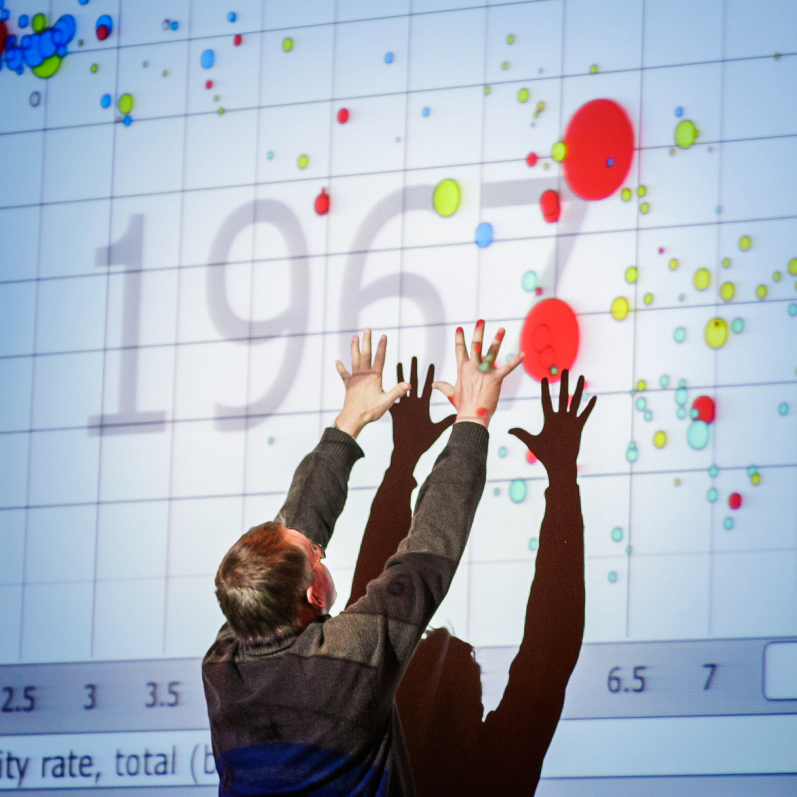

::: {.content-visible when-format="html"}
::: {#fig-rosling-cover fig-cap="Hans Rosling durante su charla TED. La visualización dinámica de Gapminder transformó la manera de comunicar tendencias globales." fig-alt="Fotografía de Hans Rosling en el escenario de TED."}

:::
:::

::: {.content-visible when-format="pdf"}
::: {#fig-rosling-cover-pdf fig-cap="Hans Rosling durante su charla TED."}
{width=0.6\textwidth}
:::
:::

::: {.callout-note appearance="simple"}
## Instrucciones

1. Mira con atención la charla TED de Hans Rosling:
   [The best stats you've ever seen](https://www.ted.com/talks/hans_rosling_the_best_stats_you_ve_ever_seen?utm_campaign=tedspread&utm_medium=referral&utm_source=tedcomshare) (20 min).

2. Responde las siguientes preguntas. No se trata de copiar datos exactos, sino de demostrar que has comprendido las ideas principales y puedes relacionarlas con lo aprendido en EPDI.
:::

---

## Preguntas

**1. Percepción vs. realidad**
Al inicio de su charla, Rosling muestra que estudiantes suecos respondieron preguntas sobre desarrollo global peor que si hubieran respondido al azar (como chimpancés). ¿Qué sesgo o problema estadístico revela esta anécdota? ¿Por qué es relevante para cualquier persona que vaya a interpretar datos?

**2. El mito del mundo dividido en dos**
Rosling afirma que la visión de un mundo partido entre «países desarrollados» y «países en desarrollo» ya no se sostiene con los datos. ¿Qué variables utiliza para demostrarlo? ¿Qué tipo de gráfico emplea y por qué es efectivo para comunicar esta idea?

**3. De la correlación a la causalidad**
En un momento de la charla, Rosling muestra que la esperanza de vida está fuertemente asociada con el acceso a agua potable, jabón y alimentos. ¿Podemos afirmar que estos factores *causan* una mayor esperanza de vida? Explica tu respuesta usando los conceptos de *estudio observacional* y *variable de confusión* vistos en EPDI.

**4. El poder de la visualización dinámica**
Rosling no usa tablas ni gráficos estáticos: emplea burbujas animadas que se mueven a lo largo del tiempo. ¿Qué ventajas tiene esta forma de presentar datos frente a una tabla de contingencia o un gráfico de barras tradicional? Piensa en lo que permite ver y en lo que podría ocultar.

**5. ¿Con qué mentalidad miras los datos?**
Rosling sugiere que nuestra visión del mundo está determinada por el año en que nacieron nuestros profesores. ¿Cómo se relaciona esta idea con el concepto de *sesgo de confirmación*? ¿Qué estrategias propone Rosling (o podrías proponer tú) para mantener actualizada nuestra comprensión del mundo?

**6. Hechos, emociones y persuasión**
Rosling ha sido llamado «edutainer» (educador + entertainer). Su charla combina datos, humor, competición deportiva y software llamativo. ¿Crees que estos recursos ayudan a comunicar la estadística o corre el riesgo de distorsionarla? ¿Qué lección puedes extraer para tu propia defensa final de EPDI?
